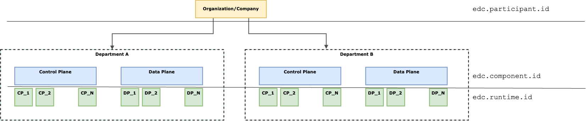

# Components and IDs

## Decision

In addition to the `edc.participant.id` and `edc.runtime.id` properties, a new ID `edc.component.id` will be introduced.
This is to better reflect the notion of a _components_ and _runtimes_.

## Rationale

Components are logical deployment units, for example a _control plane_, a _data plane_, an _identity hub_, _federated
catalog_ etc. Each component can consist of 1..N _runtimes_, which are individually running processes.

Components are deployed within a _management domain_, which is a realm of control within a company such as a specific
department. While management domains don't exist as first-level technical concept (i.e. there is no
dedicated `edc.management.domain.id`), they are still relevant to understand the hierarchy.

An organization participating in a dataspace always has one `participantId`, which is shared by all management domains
and components and runtimes therein. This is the "dataspace identity" of the organization.

A management domain would be analogous to a department operating its own Kubernetes cluster, which can contain several
logically individual _components. A _component_ would be analogous to a Deployment in Kubernetes, having its
own `componentId`. This `componentId` must be stable across restarts and (re-)deployments. 

Then, each _component_ consists of 1..N _runtimes_, which are individual processes (usually running in a container).
These would be analogous to individual replica in Kubernetes. Each _runtime_ has its own (random) `runtimeId`.

These IDs have the following properties:

| name            | Java property        | description                                                               | default value | used for                                |
|-----------------|----------------------|---------------------------------------------------------------------------|---------------|-----------------------------------------|
| `participantId` | `edc.participant.id` | stable, immutable, unique identifier of the organization. Could be a DID. |               | DSP/DCP interactions, contracts, VCs    |
| `componentId`   | `edc.component.id`   | stable, unique but internal name that identifies a particular component   | random string | data plane registration and selection   |
| `runtimeId`     | `edc.runtime.id`     | random string that is regenerated on every runtime restart                | random string | database-level exclusive locks (Leases) |

_Note that management domains only exist as architectural concept, not as a technical element._

## Approach

Assuming that the `runtimeId` was previously used to assign stable IDs and to provide backwards compatibility, the
following changes are required:

- Introduce a new property `edc.component.id` and issue a `WARNING` message if it is not configured.
- Refactor `edc.runtime.id`: if it is configured, issue a `WARNING` and replace the value with a random string. If
  the `edc.component.id` is _not_ configured, use the configured `edc.runtime.id` as `edc.component.id`

That way we can guarantee that the `runtimeId` is always randomized, and deployments who had used it as stable
identifier previously maintain the same semantics.

## Additional Notes

This concept is inspired a lot by the hierarchy of typical Kubernetes deployments. This is intentional, as Kubernetes is
the de-facto standard for distributed applications and services in enterprise environments. This certainly does not mean
that EDC _must be run_ on Kubernetes, but most production installations are likely to be on Kubernetes and will thus
mirror the hierarchical concepts.