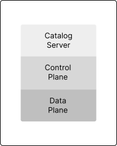
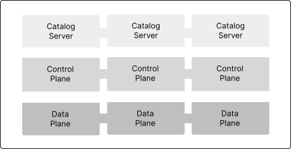
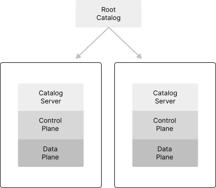
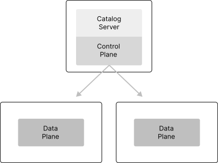

# Distributions, Deployment, and Operations

## Using the Basic Template Repository to Create Distributions

The [Modules, Runtimes, and Components](Modules, Runtimes, and Components.md) chapter explained how EDC is built on a module system. Runtimes are assembled to create a *component* such as a control plane, a data plane, or an identity hub. EDC itself does not ship runtime distributions since it is the job of downstream projects to bundle features and capabilities that address the specific requirements of a dataspace or organization.  However, EDC provides the [Basic Template Repository](https://github.com/eclipse-edc/Template-Basic) to facilitate creating extensions and runtime distributions. 

The EDC Basic Template Repository can be forked and used as a starting point for building an EDC distribution. You will need to be familiar with Maven Repositories and [Gradle](https://gradle.org/). Once the repository is forked, custom extensions can be added and included in a runtime. The template is configured to create two runtime Docker images: a control plane and data plane. These images are designed to be deployed as separate processes, such as two Kubernetes `Replicasets`. 

> EDC distributions can be created using other build systems if they support Maven dependencies since EDC modules are released to Maven Central. Using Gradle as the build system for your distribution has several advantages. One is that the distribution project can incorporate [EDC Gradle Plugins](https://github.com/eclipse-edc/GradlePlugins)such as the Autodoc and Build plugins to automate and remove boilerplate tasks. 

## Deployment Architectures and Operations

EDC does not dictate a specific deployment architecture. Components may be deployed to an edge device as a single low-footprint runtime or across multiple high-availability clusters. When deciding on an appropriate deployment architecture and operations setup, three considerations should be taken into account:

- How is your organization structured to manage data sharing?
- How should scaling be done?
- What components need to be highly available?

The answers to these questions will help define the required deployment architecture. We recommend starting with the simplest solution possible and only adding complexity when required. For example, a data plane must often be highly available and scalable, but a control plane does not. In this case, the deployment architecture should split the components and allocate different cluster resources to the data plane. We will now examine each question and how they impact deployment architectures.

## Management Domains

The first question that needs to be assessed is: How is your organization structured to manage data sharing? In the simplest scenario, an organization may have a single IT department responsible for data sharing and dataspace membership company-wide. This is relatively easy to solve. EDC components can be deployed and managed by the same operations team. The deployment architecture will be influenced more by scaling and high-availability requirements.

Now, let's look at a more complex case in which a multinational organization delegates data-sharing responsibilities to individual units. Each unit has its own IT department and data centers. In this setup, EDC components must be deployed and managed separately. This will impact control planes, data planes, and Identity Hubs. For example, the company could operate a central Identity Hub to manage organizational credentials and delegate control plane and data plane operations to the units. This requires a more complex deployment architecture where control and data planes may be hosted in separate environments, such as multiple cloud tenants.

To accommodate diverse deployment requirements, EDC supports *management domains.* A management domain is ***a realm of control over a set of EDC components***. Management domains enable the operational responsibility of EDC components to be delegated throughout an organization. The following components may be included in a single management domain or spread across multiple domains:
- Catalog Server
- Control Plane
- Data Plane
- Identity Hub

To simplify things, we will focus on how a catalog server, control plane, and data plane can be deployed before discussing the Identity Hub. Management domains may be constructed to support the following deployment topologies.

### Type 1: Single Management Domain

A single management domain deploys EDC components under one unified operations setup. In this topology, EDC components
can be deployed to a single, collocated process (management domains are represented by the black bounding box):



***Type 1: One management domain controlling a single instance***

More complex operational environments may deploy EDC components as separate clustered instances under the operational
control of a single management domain. For example, a Kubernetes cluster could be deployed with separate *ReplicateSets*
running pods of catalog servers, control planes, and data planes:



***Type 1: One management domain controlling a cluster of individual ReplicaSets***

### Type 2: Distributed Management Domains

Single management domain topologies are not practical in organizations with independent subdivisions. Often, each subdivision is responsible for all or part of the data-sharing process. To accommodate these use cases, EDC components deployed to separate operational contexts (and hence separate management domains) must function together.

Consider the example of a large multinational conglomerate, Foo Industries, which supplies parts for widget production. Foo Industries has separate geographic divisions for production. Each division is responsible for sharing its supply chain data with Foo's partners as part of the Widget-X Dataspace. Foo Industries participates under a single corporate identity in the dataspace, in this case using the Web DID `did:web:widget-x.foo.com`. Some partners may have access to only one of Foo's divisions.

Foo Industries can support this scenario by adopting a ***distributed management domain topology***. There are several different ways to distribute management domains.

#### Type 2A: DSP Catalog Referencing EDC Stacks

Let's take the simplest to start: each division deploys an EDC component stack. Externally, Foo Industries presents a unified DSP Catalog obtained by resolving the catalog endpoint from Foo's Web DID, `did:web:widget-x.foo.com`. The returned catalog will contain entries for the Foo Industries divisions a client can access (the mechanics of how this is done are explained below). Specifically, the component serving the DSP catalog would _not_ be an EDC component, and thus not be subject to any management domains. To support this setup, Foo Industries could deploy the following management domains:



***Type 2A: Distributed Management Domains containing an EDC stack***

Here, two primary management domains contain a full EDC stack each. A root catalog (explained below) serves as the main entry point for client requests.

#### Type 2B: EDC Catalog Server and Control/Data Plane Runtimes

Foo Industries could also choose to deploy EDC components in separate management domains. For example, a central catalog server that runs in its own management domain and that fronts two other management domains consisting of control/data plane runtimes:



***Type 2B: Distributed Management Domains containing a Catalog Server and separate Control/Data Plane runtimes***

#### Type 2C: Catalog Server/Control Plane with Data Plane Runtime

Or, Foo Industries could elect to run a centralized catalog server/control plane:


***Type 2C: Distributed Management Domains containing a Catalog Server/Control Plane and separate Data Plane runtimes***

### Identity Hub

The primary deployment scenario for Identity Hub is to run it as a central component under its own management domain. While Identity Hub instances could be distributed and included in the same management domains as a control/data plane pair, this would entail a much more complex setup, including credential, key, and DID document replication that is not supported out-of-the-box. 

### Setting Up Management Domains

Management domains are straightforward to configure as they mainly involve catalog setup. Recall how catalogs are structured as described in the chapter on [Control Plane concepts](Control Plane Concepts.md). Catalogs contain *datasets*, *distributions*, and *data services*. Distributions define the wire protocol used to transfer data and refer to a data service endpoint where a contract agreement can be negotiated to access the data. What was not mentioned is that a catalog is a dataset, which means catalogs can contain sub-catalogs. EDC takes advantage of this to implement management domains using linked catalogs. Here's an example of a catalog with a linked sub-catalog:

```json
{
  "@context": "https://w3id.org/dspace/v0.8/context.json",
  "@id": "urn:uuid:3afeadd8-ed2d-569e-d634-8394a8836d57",
  "@type": "dcat:Catalog",
  "dct:title": "Foo Industries Provider Root Catalog",
  "dct:description": [
    "A catalog of catalogs"
  ],
  "dcat:catalog": {
    "@type": "dcat:Catalog",
	"dct:description": [
	   "Foo Industries Sub-Catalog"
	],
    "dcat:distribution": {
      "@type": "dcat:Distribution",
      "dcat:accessService": "urn:uuid:4aa2dcc8-4d2d-569e-d634-8394a8834d77"
    },
    "dcat:service": [
      {
        "@id": "urn:uuid:4aa2dcc8-4d2d-569e-d634-8394a8834d77",
        "@type": "dcat:DataService",
        "dcat:endpointURL": "https://foo-industries.com/subcatalog"
      }
    ]
  }
}
```

In this case, the data service entry contains an `endpointURL` that resolves the contents of the sub-catalog. EDC deployments can consist of multiple sub-catalogs and nested sub-catalogs to reflect a desired management structure. For example, Foo Industries could include a sub-catalog for each division in its root catalog, where sub-catalogs are served from separate management domains. This setup would correspond to Type 2A shown above.

#### Configuring Linked Catalogs

Datasets are created from assets. The same is true for linked catalogs. Adding the following asset with the root catalog server's Management API is the first step to creating a sub-catalog entry:

```json
{
  "@context": {
    "@vocab": "https://w3id.org/edc/v0.0.1/ns/"
  },
  "@id": "subcatalog-id",
  "@type": "CatalogAsset",
  "properties": {...},
  "dataAddress": {
    "type": "HttpData",
    "baseUrl": "https://foo-industries.com/subcatalog"
  }
}
```

There are two things to note. First, the `@type` is set to CatalogAsset (which Json-Ld expands to `https://w3id.org/edc/v0.0.1/ns/CatalogAsset`).  Second, the `baseUrl` of the data address is set to the sub-catalog's ***publicly accessible*** URL. 

The next step in creating a sub-catalog is to decide on access control, that is, which clients can see the sub-catalog. Recall that this is done with a contract definition. A contract definition can have an empty policy ("allow all") or require specific credentials. It can also apply to (select) all sub-catalogs, sub-catalogs containing a specified property value, or a specific sub-catalog. The following contract definition applies an access policy and selects the previous sub-catalog:

```json
{
  "@context": {
    "edc": "https://w3id.org/edc/v0.0.1/ns/"
  },
  "@type": "https://w3id.org/edc/v0.0.1/ns/ContractDefinition",
  "@id": "test-id",
  "edc:accessPolicyId": "access-policy-1234",
  "edc:contractPolicyId": "contract-policy-5678",
  "edc:assetsSelector": [
    {
      "@type": "https://w3id.org/edc/v0.0.1/ns/Criterion",
      "edc:operandLeft": "id",
      "edc:operator": "in",
      "edc:operandRight": ["subcatalog-id"]
    },
  ]
}
```

Alternatively, the following contract definition example selects a group of sub-catalogs in the "EU" region:

```json
{
  "@context": {
    "edc": "https://w3id.org/edc/v0.0.1/ns/"
  },
  "@type": "https://w3id.org/edc/v0.0.1/ns/ContractDefinition",
  "@id": "test-id",
  "edc:accessPolicyId": "group-access-policy-1234",
  "edc:contractPolicyId": "contract-policy-5678",
  "edc:assetsSelector": [
    {
      "@type": "https://w3id.org/edc/v0.0.1/ns/Criterion",
      "edc:operandLeft": "region",
      "edc:operator": "=",
      "edc:operandRight": "EU"
    },
  ]
}
```

Once the catalog asset and a corresponding contract definition are loaded, a sub-catalog will be included in a catalog response for matching clients. Clients can then resolve the sub-catalogs by following the appropriate data service link.

#### Management Domain Considerations

If connector components are deployed to more than one management domain, it's important to keep in mind that contract agreements, negotiations, and transfer processes will be isolated to a particular domain. In most cases, that is the desired behavior. If you need to track contract agreements across management domains, one way to do this is to build an EDC extension that replicates this information to a central store that can be queried. EDC's eventing system can be used to implement a listener that receives contract and transfer process events and forwards the information to a target destination. 

### Component Scaling

Management domains help align a deployment architecture with an organization's governance requirements for data sharing. Another factor that impacts deployment architecture is potential scalability bottlenecks. While measurements are always better than assumptions, the most likely potential bottleneck is moving data from a provider to a consumer, in other words, the data plane.

Two design considerations are important here. First, as explained in the chapter on [Control Plane concepts](Control Plane Concepts.md), do not model assets in a granular fashion. For example, if data consists of a series of small JSON objects, don't model those as individual assets requiring separate contract negotiations and transfer processes. Instead, model the data as a single asset that can be requested using a single contract agreement through an API.

The second consideration entails how best to optimize data plane performance. In the previous example, the data plane will likely need to be much more performant than the control plane since the request rate will be significantly greater. This means that the data plane will also need to be scaled independently. Consequently, the data plane should be deployed separately from the control plane, for example, as a Kubernetes *ReplicaSet* running on a dedicated cluster. 

### Component High Availability

Another consideration that will impact deployment architecture is availability requirements. Consider this carefully. High availability is different from reliability. High availability measures uptime, while reliability measures correctness, i.e., did the system handle an operation in the expected manner? All EDC components are designed to be reliable. For example, remote messages are de-duplicated and handled transactionally. 

High availability is instead a function of an organization's requirements. A data plane must often be highly available, particularly if a shared data stream should not be subject to outages. However, a control plane may not need the same guarantees. For example, it may be acceptable for contract negotiations to be temporarily offline as long as data plane operations continue uninterrupted. It may be better to minimize costs by deploying a control plane to less robust infrastructure than a data plane.  There is no hard-and-fast rule here, so you will need to decide on the approach that best addresses your organization's requirements.       


