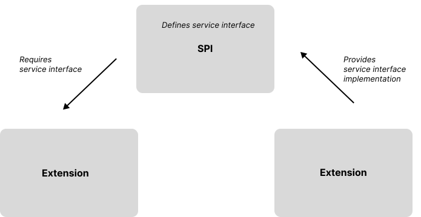

# Building Custom Extensions

This chapter covers adding custom features and capabilities to an EDC runtime by creating extensions.  Features can be wide-ranging, from a specific data validation or policy function to integration with an identity system.  We will focus on common extension use cases, for example, implementing specific dataspace requirements. For more complex features and in-depth treatment, refer to the [Contributor documentation]().

> This chapter requires a thorough knowledge of Java and modern build systems such as [Gradle](https://gradle.org/) and [Maven](https://maven.apache.org). As you read through this chapter, it will be helpful to consult the extensions contained in the [EDC Samples repository](https://github.com/eclipse-edc/Samples).
## The EDC Module System

EDC is built on a module system that contributes features as extensions to a runtime. It's accurate to say that EDC, at its core, is just a module system. Runtimes are assembled to create components such as a control plane, a data plane, or an identity hub. The EDC module system provides a great deal of flexibility as it allows you to easily add customizations and target diverse deployment topologies, from small-footprint single-instance components to highly reliable, multi-cluster setups.  

> When designing an extension, it's important to consider all the possible target deployment topologies. For example, features should typically scale up to work in a cluster and scale down to low-overhead and test environments. In addition to good architectural planning (e.g., using proper concurrency strategies in a cluster), we will cover techniques such as *default services* that facilitate support for diverse deployment environments.

To understand the EDC module system, we will start with three of its most important characteristics: static modules defined at build time, design-time encapsulation as opposed to runtime encapsulation, and a focus on *extensions,* not applications. 

The EDC module system is based on a *static design*. Unlike dynamic systems such as [OSGi](https://www.osgi.org/), EDC modules are defined at build time and are not cycled at runtime. EDC's static module system delegates the task of loading and unloading runtime images to deployment infrastructure, whether the JUnit platform or Kubernetes. A new runtime image must be deployed if a particular module needs to be loaded. In practice, this is easy to do, leverages the strengths of modern deployment infrastructure, and greatly reduces the module system's complexity.    

The EDC module system also does not support classloader isolation between modules like OSGi or the [Java Platform Module System](https://www.jcp.org/en/jsr/detail?id=376). While some use cases require strong runtime encapsulation, the EDC module system made the trade-off for simplicity. Instead, it relies on design-time encapsulation enforced by modern build systems such as Gradle or Maven, which support multi-project layouts that enforce class visibility constraints. 

Finally, the EDC module system is not a framework like [Spring](https://spring.io/). Its design is centered on managing and assembling *extensions*, not making applications easier to write by providing API abstractions and managing individual services and their dependencies.     

## Extension Basics

If you are unfamiliar with bundling EDC runtimes, please read the chapter on [Distributions, Deployment, and Operations](distributions-deployment-operations.md). Let's assume we have already enabled a runtime build that packages all EDC classes into a single executable JAR deployed in a Docker container.  

An EDC extension can be created by implementing the `ServiceExtension` interface:

```java
public class SampleExtension implements ServiceExtension {

    @Override
    public void initialize(ServiceExtensionContext context) {
        // do something
    }
}
```

To load the extension, the `SampleExtension` must be on the runtime classpath (e.g., in the runtime JAR) and configured using a [Java ServiceLoader provider file](https://docs.oracle.com/javase/8/docs/api/java/util/ServiceLoader.html). The latter is done by including an entry for the implementation class in the `META-INF/services/org.eclipse.edc.spi.system.ServiceExtension` file.

### SPI: Service Provider Interface

In the previous example, the extension did nothing. Generally, an extension provides a service to the runtime. It's often the case that an extension also requires a service contributed by another extension. The EDC module system uses the *Service Provider Interface (SPI)* pattern to enable cross-extension dependencies:



 An SPI module containing the shared service interface is created. The service implementation is packaged in a separate module that depends on the SPI module. The extension that requires the service then depends on the SPI module, not the implementation module. We will see in the next section how the EDC module system wires the service implementation to the extension that requires it. At this point, it is important to note that the build system maintains encapsulation since the two extension modules do not have a dependency relationship.

The SPI pattern is further used to define *extension points*. An extension point is an interface that can be implemented to provide a defined set of functionality. For example, there are extension points for persisting entities to a store and managing secrets in a vault. The EDC codebase is replete with SPI modules, which enables diverse runtimes to be assembled with just the required features, thereby limiting their footprint and startup overhead.  

### Providing and Injecting Services

The EDC module system assembles extensions into a runtime by wiring services to `ServiceExtensions` that require them and initialing the latter.  An extension can *provide* services that are used by other extensions. This is done by annotating a factory method with the `org.eclipse.edc.runtime.metamodel.annotation.Provider` annotation:

```java
public class SampleExtension implements ServiceExtension {

    @Provider
    public CustomService initializeService(ServiceExtensionContext context) {
        new CustomServiceImpl();
    }
}
```

In the above example, `initializeService` will be invoked when the extension is loaded to supply the `CustomService`, which will be registered so other extensions can access it. The `initializeService` method takes a `ServiceExtensionContext`, which is optional (no-param methods can also be used with `@Provider`). Provider methods must also be public and not return `void`.

> Provided services are singletons, so remember that they must be thread-safe.

The `CustomService` can be accessed by injecting it into a `ServiceExtension` using the `org.eclipse.edc.runtime.metamodel.annotation.Inject` annotation:

```java
public class SampleExtension implements ServiceExtension {

	@Inject 
	private CustomService customService;

    @Override
    public void initialize(ServiceExtensionContext context) {
        var extensionDelegate = ... // create and register a delegate with the CustomService
        customService.register(extensionDelegate);
    }
}
```

When the EDC module system starts, it scans all `ServiceExtension` implementations and builds a dependency graph from the provided and injected services. The graph is then sorted (topologically) to order extension startup based on dependencies. Each extension is instantiated, injected, and initialized in order. 

> The EDC module system does not support assigning extensions to runlevels by design. Instead, it automatically orders extensions based on their dependencies. If you find the need to control the startup order of extensions that do not have a dependency, reconsider your approach. It's often a sign of a hidden coupling that should be explicitly declared. 

### Service Registries

*Service Registries* are often used in situations where multiple implementations are required. For example, entities may need to be validated by multiple rules that are contributed as services. The recommended way to handle this is to create a registry that accepts extension services and delegates to them when performing an operation. The following is an example of a registry used to validate `DataAddresses`:

```java
public interface DataAddressValidatorRegistry {

    /**
     * Register a source DataAddress object validator for a specific DataAddress type
     *
     * @param type the DataAddress type string.
     * @param validator the validator to be executed.
     */
    void registerSourceValidator(String type, Validator<DataAddress> validator);

    /**
     * Register a destination DataAddress object validator for a specific DataAddress type
     *
     * @param type the DataAddress type string.
     * @param validator the validator to be executed.
     */
    void registerDestinationValidator(String type, Validator<DataAddress> validator);

    /**
     * Validate a source data address
     *
     * @param dataAddress the source data address.
     * @return the validation result.
     */
    ValidationResult validateSource(DataAddress dataAddress);

    /**
     * Validate a destination data address
     *
     * @param dataAddress the destination data address.
     * @return the validation result.
     */
    ValidationResult validateDestination(DataAddress dataAddress);
}
```

`Validator` instances can be registered by other extensions, which will then be dispatched to when one of the validation methods is called:

```java
```java
public class SampleExtension implements ServiceExtension {

	@Inject private DataAddressValidatorRegistry registry;

    @Override
    public void initialize(ServiceExtensionContext context) {
        var validator = ... // create and register the validator
        customService.register(TYPE, validator);
    }
}
```

###  Configuration

Extensions will typically need to access configuration. The `ServiceExtensionContext` provides several methods for reading configuration data. Configuration values are resolved in the following order:

- From a `ConfigurationExtension` contributed in the runtime. EDC includes a configuration extension that reads values from a file.
- From environment variables, capitalized names are made lowercase, and underscores are converted to dot notation. For example, "HTTP_PORT" would be transformed to "HTTP.port."
- From Java command line properties.

The recommended approach to reading configuration is through one of the two config methods: `ServiceExtensionContext.getConfig()` or `ServiceExtensionContext.getConfig(path)`. The returned `Config` object can navigate a configuration hierarchy based on the dot notation used by keys. To understand how this works, let's start with the following configuration values:

```
group.subgroup.key1=value1
group.subgroup.key2=value2

```

Invoking `context.getConfig("group")` will return a config object that can be used for typed access to `group` values or to navigate the hierarchy further:

```java
var groupConfig = context.getConfig("group");
var groupValue1 = groupConfig.getString("subgroup.key1"); // equals "value1"
var subGroupValue1 = groupConfig.getConfig("subgroup").getString("key1"); // equals "value1"
```

The `Config` class contains other useful methods, so it is worth looking at it in detail.

### Extension Loading

Service extensions have the following lifecycle that is managed by the EDC module system:

| Runtime Phase | Extension Phase | Description                                                                                                                     |
| ------------- | --------------- | ------------------------------------------------------------------------------------------------------------------------------- |
| `LOAD`        |                 | Resolves and introspects `ServiceExtension` implementations on the classpath, builds a dependency graph, and orders extensions. |
| `BOOT`        |                 | For each extension, cycle through the `INJECT`, `INITIALIZE`, and `PROVIDE` phases.                                             |
|               | `INJECT`        | Instantiate the service extension class and inject it with dependencies.                                                        |
|               | `INITIALIZE`    | Invoke the `ServiceExtension.initialize()` method.                                                                              |
|               | `PROVIDE`       | Invoke all `@Provider` factory methods on the extension instance and register returned services.                                |
| `PREPARE`     |                 | For each extension, `ServiceExtension.prepare()` is invoked.                                                                    |
| `START`       |                 | For each extension, `ServiceExtension.start()` is invoked. The runtime is in normal operating mode.                             |
| `SHUTDOWN`    |                 | For each extension in reverse order, `ServiceExtension.shutdown()` is invoked.                                                  |
Most extensions will implement the `ServiceExtension.initialize()` and `ServiceExtension.shutdown()` callbacks.

## Extension Services

### Default Services

Sometimes, it is desirable to provide a default service if no other implementation is available. For example, in an integration test setup, a runtime may provide an in-memory store implementation when a persistent storage implementation is not configured. Default services alleviate the need to explicitly configure extensions since they are not created if an alternative exists. Creating a default service is straightforward - set the `isDefault` attribute on `@Provider` to true:

```java
public class SampleExtension implements ServiceExtension {

    @Provider (isDefault = true)
    public CustomService initializeDefaultService(ServiceExtensionContext context) {
        new DefaultCustomService();
    }
}
```

If another extension implements CustomService, `SampleExtension.initializeDefaultService()` will not be invoked.

### Creating Custom APIs and Controllers 

Extensions may create custom APIs or ingress points with JAX-RS controllers. This is done by creating a *web context* and registering JAX-RS resource under that context. A web context is a port and path mapping under which the controller will be registered. For example, a context with a port and path set to `9191` and `custom-api` respectively may expose a controller annotated with `@PATH("custom-resources")` at:

`https:9191//localhost/custom-api/custom-resources`

Web contexts enable deployments to segment where APIs are exposed. Operational infrastructure may restrict management APIs to an internal network while another API may be available over the public internet.

EDC includes convenience classes for configuring a web context:

```java
public class SampleExtension implements ServiceExtension {

    @Inject
    private WebServer webServer;

	@Inject
    private WebServiceConfigurer configurer;

    @Inject
    private WebService webService;

	public void initialize(ServiceExtensionContext context) {
		var settings = WebServiceSettings.Builder.newInstance()
				.contextAlias("custom-context")
				.defaultPath("/custom-context-path")
				.defaultPort(9191)
				.name("Custom API")
				.apiConfigKey("web.http.custom-context")
				.build();

        var config = context.getConfig("web.http.custom-context");
        configurer.configure(config, webServer, settings);

		webService.registerResource("custom-context", new CustomResourceController();
        webService.registerResource("custom-context", new CustomExceptionMapper());
	}
}
```

Let's break down the above sample. The `WebServer` is responsible for creating and managing `HTTP/S` contexts. The `WebServiceConfigurer` takes a settings object and applies it to the `WebServer` to create a web context.  In the above example, the context alias is `custom-context`, which will be used later to register JAX-RS controllers. The default path and port are also set and will be used if the deployment does not provide override values as part of the runtime configuration. The settings, runtime configuration, and web server instance are then passed to the `configurer`, which registers the `HTTP/S` context. 

The default port and path can be overridden by configuration settings using the `web.http.custom-context` config key:

```
web.http.custom-context.path=/override-path
web.http.custom-context.port=9292
```

Note that the `web.http` prefix is used as a convention but is not strictly required.

Once a web context is created, JAX-RS controllers, interceptors, and other resources can be registered with the `WebService` under the web context alias. EDC uses [Eclipse Jersey](https://eclipse-ee4j.github.io/jersey/) and supports its standard features:

```java
webService.registerResource("custom-context", new CustomResourceController();
webService.registerResource("custom-context", new CustomExceptionMapper());
```

#### Authentication

To enable custom authentication for a web context, you must:
- Implement `org.eclipse.edc.api.auth.spi.AuthenticationService` and register an instance with the `ApiAuthenticationRegistry`. 
- Create an instance of the SPI class `org.eclipse.edc.api.auth.spi.AuthenticationRequestFilter` and register it as a resource for the web context.

The following code shows how to do this:

```java
public class SampleExtension implements ServiceExtension {
	
	@Inject
	private ApiAuthenticationRegistry authenticationRegistry;
	
	@Inject
	private WebService webService;
	
	@Override
	public void initialize(ServiceExtensionContext context) {
	    authenticationRegistry.register("custom-auth", new CustomAuthService());
	
	    var authenticationFilter = new AuthenticationRequestFilter(authenticationRegistry, "custom-auth");
	    webService.registerResource("custom-context", authenticationFilter);
	}
}
```

### Events

The EDC eventing system is a powerful way to add capabilities to a runtime. All event types derive from `org.eclipse.edc.spi.event.Event` and cover a variety of create, update, and delete operations, including those for:
- Assets
- Policies
- Contract definitions
- Contract negotiations
- Transfer processes

To receive an event, register and `EventSubscriber` with the `org.eclipse.edc.spi.event.EventRouter`. Events can be received either synchronously or asynchronously. Synchronous listeners are useful when executed transactionally in combination with the event operation. For example, a listener may wish to record audit information when an `AssetUpdated` event is emitted. The transaction and asset update should be rolled back if the record operation fails. Asynchronous listeners are invoked in the context of a different thread. They are useful when a listener takes a long time to complete and is fire-and-forget.

### The Monitor

EDC does not directly use a logging framework. Log output should instead be sent to the `Monitor`, which will forward it to a configured sink. By default, the Monitor sends output to the console, which can be piped to another destination in a production environment. Alternatively, a custom `Monitor` implementation can be configured. The best way to obtain a reference to the `Monitor` is to inject it:

```java
public class SampleExtension implements ServiceExtension {

	@Inject
	private Monitor monitor;

    @Provider
    public void initialize(ServiceExtensionContext context) {
        new CustomServiceImpl(monitor);
    }
}
```

If you would like to have output prefixed for a specific service, use `Monitor.withPrefix()`:

```java
public class SampleExtension implements ServiceExtension {

	@Inject
	private Monitor monitor;

    @Provider
    public void initialize(ServiceExtensionContext context) {
	    var prefixedMonitor = monitor.withPrefix("Sample Extension"); // this will prefix all output with [Sample Extension] 
        new CustomServiceImpl(prefixedMonitor);
    }
}
```

### Transactions and Datasources

EDC uses transactional operations when persisting data to stores that support them such as the Postgres-backed implementations. Transaction code blocks are written using the `TransactionContext`, which can be injected:

```java
public class SampleExtension implements ServiceExtension {

	@Inject
	private TransactionContext transactionContext;

    @Provider
    public void initialize(ServiceExtensionContext context) {
        new CustomServiceImpl(transactionContext);
    }
}
```

and then: 

```java
 return transactionalContext.execute(() -> {
     // perform transactional work
     var result = ... // get the result
     return result;
 });
```

The `TransactionContext` supports creating a new transaction or joining an existing transaction associated with the current thread:

```java
transactionalContext.execute(()-> {
		// perform work
		// in another service, execute additional work in a transactional context and they will be part of the same transaction
		return transactionalContext.execute(()-> {
		  // more work
		  return result;
		});
	}
);
```

EDC also provides a `DataSourceRegistry` for obtaining JDBC `DataSource` instances that coordinate with the `TransactionContext`:

```java
public class SampleExtension implements ServiceExtension {

	@Inject
	private DataSourceRegistry datasourceRegistry;

    @Provider
    public void initialize(ServiceExtensionContext context) {
        new CustomServiceImpl(datasourceRegistry);
    }
}
```

The registry can then be used in a transactional context to obtain a `DataSource`:

```java
transactionalContext.execute(()-> {
	var datasource = dataSourceRegistry.resolve(DATASOURCE_NAME);
	try (var connection = datasource.getConnection()) {
		// do work
		return result;
    }
});
```

EDC provides datasource connection pooling based on [Apache Commons Pool](https://commons.apache.org/proper/commons-pool/index.html). As long as the `DataSource` is accessed in the same transactional context, it will automatically return the same pooled connection, as EDC manages the association of connections with transactional contexts.

### Validation

Extensions may provide custom validation for entities using the  `JsonObjectValidatorRegistry`. For example, to register an asset validator:

```java
public class SampleExtension implements ServiceExtension {

	@Inject
	private JsonObjectValidatorRegistry validatorRegistry;

    public void initialize(ServiceExtensionContext context) {
        validator.register(Asset.EDC_ASSET_TYPE, (asset) -> {
            return ValidationResult.success();
        });
    }
}
```

Note that all entities are in Json-Ld expanded form, so you'll need to understand the intricacies of working with the JSON-P API and Json-Ld.

### Serialization

EDC provides several services related to JSON serialization. The `TypeManager` manages `ObjectMapper` instances in a runtime associated with specific serialization contexts. A serialization context provides `ObjectMapper` instances configured based on specific requirements. Generally speaking, never create an `ObjectMapper` directly since it is a heavyweight object. Promote reuse by obtaining the default mapper or creating one from a serialization context with the `TypeManager`. 

If an extension is required to work with `Json-Ld`, use the `JsonLd` service, which includes facilities for caching Json-Ld contexts and performing expansion. 

### HTTP Dispatching

Extensions should use the `EdcHttpClient` to make remote `HTTP/S` calls. The client is based on the [OkHttp library](https://square.github.io/okhttp/) and includes retry logic, which can be obtained through injection.

### Secrets Handling and the Vault

All secrets should be stored in the `Vault`. EDC supports several implementations, including one backed by [Hashicorp Vault](https://www.vaultproject.io/).

### Documenting Extensions

Remember to document your extensions! EDC AutoDoc is a Gradle plugin that automates this process and helps ensure documentation remains in sync with code.