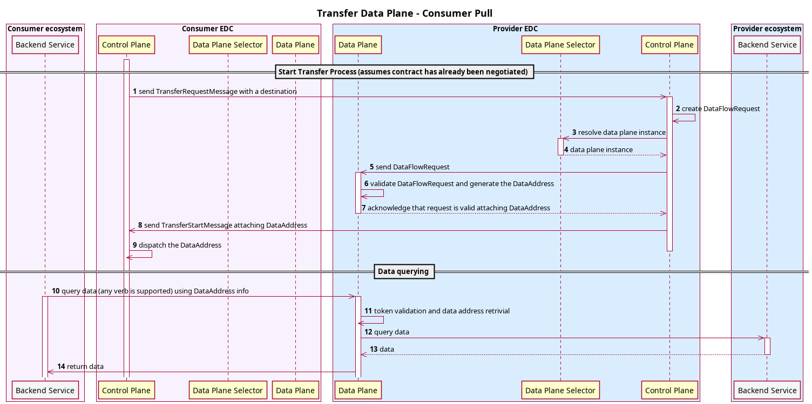

# Contributor Documentation

<!-- TOC -->
* [Contributor Documentation](#contributor-documentation)
  * [0. Intended audience](#0-intended-audience)
  * [1. Getting started](#1-getting-started)
    * [1.1 Prerequisites](#11-prerequisites)
    * [1.2 Terminology](#12-terminology)
    * [1.3 Architectural and coding principles](#13-architectural-and-coding-principles)
  * [2. The control plane](#2-the-control-plane)
    * [2.1 Entities](#21-entities)
      * [2.1.1 Assets](#211-assets)
      * [2.1.2 Policies](#212-policies)
        * [2.1.2.1 Policy vs PolicyDefinition](#2121-policy-vs-policydefinition)
        * [2.1.2.2 Policy scopes and bindings](#2122-policy-scopes-and-bindings)
        * [2.1.2.3 Policy evaluation functions](#2123-policy-evaluation-functions)
        * [2.1.2.4 Example: binding an evaluation function](#2124-example-binding-an-evaluation-function)
        * [2.1.2.5 Advanced policy concepts](#2125-advanced-policy-concepts)
          * [Pre- and Post-Evaluators](#pre--and-post-evaluators)
          * [Dynamic functions](#dynamic-functions)
      * [2.1.3 Contract definitions](#213-contract-definitions)
      * [2.1.4 Contract negotiations](#214-contract-negotiations)
      * [2.1.5 Contract agreements](#215-contract-agreements)
      * [2.1.6 Catalog](#216-catalog)
      * [2.1.7 Transfer processes](#217-transfer-processes)
        * [2.1.7.1 Transfer and data flows types](#2171-transfer-and-data-flows-types)
          * [2.1.7.1.1 Consumer Pull](#21711-consumer-pull)
          * [2.1.7.1.2 Provider Push](#21712-provider-push)
          * [2.1.7.1.2 Finite and Non-Finite Data](#21712-finite-and-non-finite-data)
        * [2.1.7.2 About Data Destinations](#2172-about-data-destinations)
        * [2.1.7.3 Transfer process callbacks](#2173-transfer-process-callbacks)
      * [2.1.8 Endpoint Data References](#218-endpoint-data-references)
      * [2.1.9 Querying with `QuerySpec` and `Criterion`](#219-querying-with-queryspec-and-criterion)
    * [2.2 Programming Primitives](#22-programming-primitives)
      * [2.2.1 State machines](#221-state-machines)
        * [2.2.1.1 Batch-size, sorting and tick-over timeout](#2211-batch-size-sorting-and-tick-over-timeout)
        * [2.2.1.2 Database-level locking](#2212-database-level-locking)
      * [2.2.2 Transformers](#222-transformers)
        * [2.2.2.1 Basic Serialization and Deserialization](#2221-basic-serialization-and-deserialization)
        * [2.2.2.1 Transformer context](#2221-transformer-context)
        * [2.2.2.2 Segmented transformer registries](#2222-segmented-transformer-registries)
        * [2.2.2.3 Reporting transformation errors](#2223-reporting-transformation-errors)
      * [2.2.3 Token generation and decorators](#223-token-generation-and-decorators)
      * [2.2.4 Token validation and rules](#224-token-validation-and-rules)
        * [2.2.4.1 Public Key Resolvers](#2241-public-key-resolvers)
        * [2.2.4.2 Validation Rules](#2242-validation-rules)
        * [2.2.4.3 Validation Rules Registry](#2243-validation-rules-registry)
    * [2.3 Serialization via JSON-LD](#23-serialization-via-json-ld)
    * [2.4 Extension model](#24-extension-model)
      * [2.4.1 Extension basics](#241-extension-basics)
      * [2.4.2 Autodoc and Metamodel Annotations](#242-autodoc-and-metamodel-annotations)
      * [2.4.3 Configuration and best practices](#243-configuration-and-best-practices)
    * [2.5 Dependency injection deep dive](#25-dependency-injection-deep-dive)
      * [2.5.1 Registering a service implementation](#251-registering-a-service-implementation)
        * [2.5.1.1 Use `@Provider` methods (recommended)](#2511-use-provider-methods-recommended)
        * [2.5.1.2 Provide "defaults"](#2512-provide-defaults)
        * [2.5.1.3 Register manually (not recommended)](#2513-register-manually-not-recommended)
      * [2.5.2 Injecting a service](#252-injecting-a-service)
        * [2.5.2.1 Use `@Inject` to declare dependencies (recommended)](#2521-use-inject-to-declare-dependencies-recommended)
        * [2.5.2.2 Use `@Requires` to declare dependencies](#2522-use-requires-to-declare-dependencies)
      * [2.5.3 Extension initialization sequence](#253-extension-initialization-sequence)
      * [2.5.4 Testing extension classes](#254-testing-extension-classes)
      * [2.5.5 Advanced concepts: default providers](#255-advanced-concepts-default-providers)
        * [2.5.5.1 Fallbacks versus extensibility](#2551-fallbacks-versus-extensibility)
        * [2.5.5.2 Fallback implementations](#2552-fallback-implementations)
        * [2.5.5.3 Extensibility](#2553-extensibility)
        * [2.5.5.4 Deep-dive into extension lifecycle management](#2554-deep-dive-into-extension-lifecycle-management)
        * [2.5.5.5 Example 1 - provider method](#2555-example-1---provider-method)
        * [2.5.5.6 Example 2 - default provider method](#2556-example-2---default-provider-method)
        * [2.5.5.7 Usage guidelines when using default providers](#2557-usage-guidelines-when-using-default-providers)
      * [2.5.6 Limitations](#256-limitations)
    * [2.6 Service layers](#26-service-layers)
      * [2.6.1 API controllers](#261-api-controllers)
        * [2.6.1.1 API contexts](#2611-api-contexts)
        * [2.6.1.2 Registering controllers](#2612-registering-controllers)
        * [2.6.1.3 Registering other resources](#2613-registering-other-resources)
        * [2.6.1.4 API Authentication](#2614-api-authentication)
      * [2.6.2 Validators](#262-validators)
      * [2.6.3 Transformers](#263-transformers)
      * [2.6.4 Aggregate services](#264-aggregate-services)
      * [2.6.5 Data persistence](#265-data-persistence)
        * [2.6.1.1 In-Memory stores](#2611-in-memory-stores)
    * [2.7 Policy Monitor](#27-policy-monitor)
    * [2.8 Protocol extensions (DSP)](#28-protocol-extensions-dsp)
    * [2.9 (Postgre-)SQL persistence](#29-postgre-sql-persistence)
    * [2.10 Data plane signaling](#210-data-plane-signaling)
  * [3. The data plane](#3-the-data-plane)
    * [3.1 Data plane self-registration](#31-data-plane-self-registration)
    * [3.2 Public API authentication](#32-public-api-authentication)
    * [3.3 Writing a custom data plane extension (sink/source)](#33-writing-a-custom-data-plane-extension-sinksource)
    * [3.4 Writing a custom data plane (using only DPS)](#34-writing-a-custom-data-plane-using-only-dps)
  * [4. Development best practices](#4-development-best-practices)
    * [4.1 Writing Unit-, Component-, Integration-, Api-, EndToEnd-Tests](#41-writing-unit--component--integration--api--endtoend-tests)
    * [4.1 Other best practices](#41-other-best-practices)
  * [5. Further concepts](#5-further-concepts)
    * [5.1 Events and callbacks](#51-events-and-callbacks)
    * [5.2 Autodoc](#52-autodoc)
    * [5.3 Adapting the Gradle build](#53-adapting-the-gradle-build)
<!-- TOC -->
## 0. Intended audience

This document is aimed at software developers who have already read the [adopter documentation](../for-adopters) and
want to contribute code to the Eclipse Dataspace Components project.

Its purpose is to explain in greater detail the core concepts of EDC. After reading through it, readers should have a
good understanding of EDCs inner workings, implementation details and some of the advanced concepts.

So if you are a solution architect looking for a high-level description on how to integrate EDC, or a software engineer
who wants to use EDC in their project, then this guide is not for you. More suitable resources can be found
[here](https://eclipse-edc.github.io/docs/#/README) and [here](../for-adopters) respectively.

## 1. Getting started

### 1.1 Prerequisites

This document presumes a good understanding and proficiency in the following technical areas:

- JSON and [JSON-LD](https://json-ld.org)
- HTTP/REST
- relational databases (PostgreSQL) and transaction management
- git and git workflows

Further, the following tools are required:

- Java Development Kit 17+
- Gradle 8+
- a POSIX compliant shell (bash, zsh,...)
- a text editor
- CLI tools like `curl` and `git`

This guide will use CLI tools as common denominator, but in many cases graphical alternatives exist (e.g. Postman,
Insomnia, some database client, etc.), and most developers will likely use IDEs like IntelliJ or VSCode. We are of
course aware of them and absolutely recommend their use, but we simply cannot cover and explain every possible
combination of OS, tool and tool version.

> Note that Windows is not a supported OS at the moment. If Windows is a must, we recommend using WSL2 or a setting up a
> Linux VM.

### 1.2 Terminology

- runtime: a Java process executing code written in the EDC programming model (e.g. a control plane)
- distribution: a specific combination of modules, compiled into a runnable form, e.g. a fat JAR file, a Docker image
  etc.
- launcher: a runnable Java module, that pulls in other modules to form a distribution. "Launcher" and "distribution"
  are sometimes used synonymously
- connector: a control plane runtime and 1...N data plane runtimes. Sometimes used interchangeably with "distribution".
- consumer: a dataspace participant who wants to ingest data under the access rules imposed by the provider
- provider: a dataspace participant who offers data assets under a set of access rules

### 1.3 Architectural and coding principles

When EDC was originally created, there were a few fundamental architectural principles around which we designed and
implemented all dataspace components. These include:

- **asynchrony**: all external mutations of internal data structures happen in an asynchronous fashion. While the REST
  requests to trigger the mutations may still be synchronous, the actual state changes happen in an asynchronous and
  persistent way. For example starting a contract negotiation through the API will only return the negotiation's ID, and
  the control plane will cyclically advance the negotiation's state.
- **single-thread processing**: the control plane is designed around a set of sequential [state
  machines](#221-state-machines), that employ pessimistic locking to guard against race conditions and other problems.
- **idempotency**: requests, that do not trigger a mutation, are idempotent. The same is true when provisioning external
  resources.
- **error-tolerance**: the design goal of the control plane was to favor correctness and reliability over (low) latency.
  That means, even if a communication partner may not be reachable due to a transient error, it is designed to cope with
  that error and attempt to overcome it.

Prospective contributors to the Eclipse Dataspace Components are well-advised to follow these principles and build their
applications around them.

There are other, less technical principles of EDC such as simplicity and self-contained-ness. We are extremely careful
when adding third-party libraries or technologies to maintain a simple, fast and un-opinionated platform.

Take a look at our [coding principles](../../contributing/coding-principles.md) and our
[styleguide](../../contributing/styleguide.md).

## 2. The control plane

Simply put, the control plane is the brains of a connector. Its tasks include handling protocol and API requests,
managing various internal asynchronous processes, validating policies, performing participant authentication and
delegating the data transfer to a data plane. Its job is to handle (almost) all business logic. For that, it is designed
to favor _reliability_ over _low latency_. It does **not** directly transfer data from source to destination.

The primary way to interact with a connector's control plane is through the Management API, all relevant Java modules
are located at `extensions/control-plane/api/management-api`.

### 2.1 Entities

#### 2.1.1 Assets

Assets are containers for metadata, they do **not** contain the actual bits and bytes. Say you want to offer a file to
the dataspace, that is physically located in an S3 bucket, then the corresponding `Asset` would contain metadata about
it, such as the content type, file size, etc. In addition, it could contain _private_ properties, for when you want to
store properties on the asset, which you _do not want to_ expose to the dataspace. Private properties will get ignored
when serializing assets out over DSP.

A very simplistic `Asset` could look like this:

```json
{
  "@context": {
    "edc": "https://w3id.org/edc/v0.0.1/ns/"
  },
  "@id": "79d9c360-476b-47e8-8925-0ffbeba5aec2",
  "properties": {
    "somePublicProp": "a very interesting value"
  },
  "privateProperties": {
    "secretKey": "this is secret information, never tell it to the dataspace!"
  },
  "dataAddress": {
    "type": "HttpData",
    "baseUrl": "http://localhost:8080/test"
  }
}
```

The `Asset` also contains a `DataAddress` object, which can be understood as a "pointer into the physical world". It
contains information about where the asset is physically located. This could be a HTTP URL, or a complex object. In the
S3 example, that `DataAddress` might contain the bucket name, region and potentially other information. Notice that the
_schema_ of the `DataAddress` will depend on where the data is physically located, for instance a `HttpDataAddress` has
different properties from an S3 `DataAddress`. More precisely, Assets and DataAddresses are _schemaless_, so there is no
schema enforcement beyond a very basic validation. Read [chapter 2.6](#26-service-layers) to learn about plugging in
custom validators.

A few things must be noted. First, while there isn't a _strict requirement_ for the `@id` to be a UUID, we highly
recommend using the JDK `UUID` implementation.

Second, _never_ store access credentials such as passwords, tokens, keys etc. in the `dataAddress` or even the
`privateProperties` object. While the latter does not get serialized over DSP, both properties are persisted in the
database. Always use a HSM to store the credential, and hold a reference to the secret in the DataAddress. Checkout
[chapter 4](#4-development-best-practices) for details.

By design, Assets are extensible, so users can store any metadata they want in it. For example, the `properties` object
could contain a simple string value, or it could be a complex object, following some custom schema. Be aware, that
unless specified otherwise, all properties are put under the `edc` namespace by default. There are some "well-known"
properties in the `edc` namespace: `id`, `description`, `version`, `name`, `contenttype`.

Here is an example of how an Asset with a custom property following a custom namespace would look like:

```json
{
  "@context": {
    "edc": "https://w3id.org/edc/v0.0.1/ns/",
    "sw": "http://w3id.org/starwars/v0.0.1/ns/"
  },
  "@id": "79d9c360-476b-47e8-8925-0ffbeba5aec2",
  "properties": {
    "faction": "Galactic Imperium",
    "person": {
      "name": "Darth Vader",
      "webpage": "https://death.star"
    }
  }
}
```

(assuming the `sw` context contains appropriate definitions for `faction` and `person`).

Remember that upon ingress through the Management API, all JSON-LD objects get
[expanded](https://www.w3.org/TR/json-ld11/#expanded-document-form), and the control plane only operates on expanded
JSON-LD objects. The Asset above would look like this:

```json
[
  {
    "@id": "79d9c360-476b-47e8-8925-0ffbeba5aec2",
    "https://w3id.org/edc/v0.0.1/ns/properties": [
      {
        "https://w3id.org/starwars/v0.0.1/ns/faction": [
          {
            "@value": "Galactic Imperium"
          }
        ],
        "http://w3id.org/starwars/v0.0.1/ns/person": [
          {
            "http://w3id.org/starwars/v0.0.1/ns/name": [
              {
                "@value": "Darth Vader"
              }
            ],
            "http://w3id.org/starwars/v0.0.1/ns/webpage": [
              {
                "@value": "https://death.star"
              }
            ]
          }
        ]
      }
    ]
  }
]
```

This is important to keep in mind, because it means that Assets get persisted in their expanded form, and operations
performed on them (e.g. querying) in the control plane must also be done on the expanded form. For example, a query
targeting the `sw:faction` field from the example above would look like this:

```json
{
  "https://w3id.org/edc/v0.0.1/ns/filterExpression": [
    {
      "https://w3id.org/edc/v0.0.1/ns/operandLeft": [
        {
          "@value": "https://w3id.org/starwars/v0.0.1/ns/faction"
        }
      ],
      "https://w3id.org/edc/v0.0.1/ns/operator": [
        {
          "@value": "="
        }
      ],
      "https://w3id.org/edc/v0.0.1/ns/operandRight": [
        {
          "@value": "Galactic Imperium"
        }
      ]
    }
  ]
}
```

#### 2.1.2 Policies

Policies are the EDC way of expressing that certain conditions may, must or must not be satisfied in certain situations.
Policies are used to express what requirements a subject (e.g. a communication partner) must fulfill in
order to be able to perform an action. For example, that the communication partner must be headquartered in the European
Union.

Policies are [ODRL](https://www.w3.org/TR/odrl-model/) serialized as JSON-LD. Thus, our previous example would look like
this:

```json
{
  "@context": {
    "edc": "https://w3id.org/edc/v0.0.1/ns/"
  },
  "@type": "PolicyDefinition",
  "policy": {
    "@context": "http://www.w3.org/ns/odrl.jsonld",
    "@type": "Set",
    "duty": [
      {
        "target": "http://example.com/asset:12345",
        "action": "use",
        "constraint": {
          "leftOperand": "headquarter_location",
          "operator": "eq",
          "rightOperand": "EU"
        }
      }
    ]
  }
}
```

The `duty` object expresses the semantics of the constraint. It is a specialization of `rule`, which expresses either a
MUST (`duty`), MAY (`permission`) or MUST NOT (`prohibition`) relation. The `action` expresses the type of action for
which the rule is intended. Acceptable values for `action` are defined [here](https://www.w3.org/TR/odrl-model/#action),
but in EDC you'll exclusively encounter `"use"`.

The `constraint` object expresses logical relationship of a key (`leftOperand`), the value (`righOperand`) and the
`operator`. Multiple constraints can be linked with logical operators, see [advanced policy
concepts](#2125-advanced-policy-concepts). The `leftOperand` and `rightOperand` are completely arbitrary, only the
`operator` is limited to the following possible values: `eq`, `neq`, `gt`, `geq`, `lt`, `leq`, `in`, `hasPart`, `isA`,
`isAllOf`, `isAnyOf`, `isNoneOf`.

Please note that not all operators are always allowed, for example `headquarter_location lt EU` is nonsensical and
should result in an evaluation error, whereas `headquarter_location isAnOf [EU, US]` would be valid. Whether an
`operator` is valid is solely defined by the [policy evaluation function](#2123-policy-evaluation-functions), supplying
an invalid operator should raise an exception.

##### 2.1.2.1 Policy vs PolicyDefinition

In EDC we have two general use cases under which we handle and persist policies:

1. for use in contract definitions
2. during contract negotiations

In the first case policies are ODRL objects and thus must have a `uid` property. They are typically used in contract
definitions.

> Side note: the ODRL context available at `http://www.w3.org/ns/odrl.jsonld` simply defines `uid` as an alias to the
> `@id` property. This means, whether we use `uid` or `@id` doesn't matter, both expand to the same property `@id`.

However in the second case we are dealing with DCAT objects, that have no concept of Offers, Policies or Assets. Rather,
their vocabulary includes Datasets, Dataservices etc. So when deserializing those DCAT objects there is no way to
reconstruct `Policy#uid`, because the JSON-LD structure does not contain it.

To account for this, we defined the `Policy` class as value object that contains rules and other properties. In
addition, we have a `PolicyDefinition` class, which contains a `Policy` and an `id` property, which makes it an
_entity_.

##### 2.1.2.2 Policy scopes and bindings

A policy scope is the "situation", in which a policy is evaluated. For example, a policy may need to be evaluated when a
contract negotiation is attempted. To do that, EDC defines certain points in the code called "scopes" to which policies
are _bound_. These policy scopes (sometimes called policy evaluation points) are static, injecting/adding additional
scopes is not possible. Currently, the following scopes are defined:

- `contract.negotiation`: evaluated upon initial contract offer. Ensures that the consumer fulfills the contract policy.
- `transfer.process`: evaluated before starting a transfer process to ensure that the policy of the [contract
  agreement](#214-contract-agreements) is fulfilled. One example would be contract expiry.
- `catalog`: evaluated when the catalog for a particular participant agent is generated. Decides whether the participant
  has the asset in their catalog.
- `request.contract.negotiation`: evaluated on every request during contract negotiation between two control plane
  runtimes. Not relevant for end users.
- `request.transfer.process`: evaluated on every request during transfer establishment between two control plane
  runtimes. Not relevant for end users.
- `request.catalog`: evaluated upon an incoming catalog request. Not relevant for end users.
- `provision.manifest.verify`: evaluated during the precondition check for resource provisioning. Only relevant in
  advanced use cases.

A policy scope is a string that is used for two purposes:

1. binding a scope to a rule type: implement filtering based on the `action` or the `leftOperand` of a policy. This
   determines for every rule inside a policy whether it should be evaluated in the given scope. In other words, it
   determines _if_ a rule should be evaluated.
2. binding a [policy evaluation function](#2123-policy-evaluation-functions) to a scope: if a policy is determined to be
   "in scope" by the previous step, the policy engine invokes the evaluation function that was bound to the scope to
   evaluate if the policy is fulfilled. In other words, it determines (implements) _how_ a rule should be evaluated.

##### 2.1.2.3 Policy evaluation functions

If policies are a formalized declaration of requirements, policy evaluation functions are the means to evaluate those
requirements. They are pieces of Java code executed at runtime. A policy on its own only _expresses_ the requirement,
but in order to enforce it, we need to run policy evaluation functions.

Upon evaluation, they receive the operator, the `rightOperand` (or _rightValue_), the rule, and the `PolicyContext`. A
simple evaluation function that asserts the headquarters policy mentioned in the example above could look similar to
this:

```java
import org.eclipse.edc.policy.engine.spi.AtomicConstraintFunction;

public class HeadquarterFunction implements AtomicConstraintFunction<Duty> {
    public boolean evaluate(Operator operator, Object rightValue, Permission rule, PolicyContext context) {
        if (!(rightValue instanceof String)) {
            context.reportProblem("Right-value expected to be String but was " + rightValue.getClass());
            return false;
        }
        if (operator != Operator.EQ) {
            context.reportProblem("Invalid operator, only EQ is allowed!");
            return false;
        }

        var participant = context.getContextData(ParticipantAgent.class);
        var participantLocation = extractLocationClaim(participant); // EU, US, etc.
        return participantLocation != null && rightValue.equalsIgnoreCase(participantLocation);
    }
}
```

This particular evaluation function only accepts `eq` as operator, and only accepts scalars as `rightValue`, no list
types.

The `ParticipantAgent` is a representation of the communication counterparty that contains a set of verified claims. In
the example, `extractLocationClaim()` would look for a claim that contains the location of the agent and return it as
string. This can get quite complex, for example, the claim could contain geo-coordinates, and the evaluation function
would have to perform inverse address geocoding.

Other policies may require other context data than the participant's location, for example an exact timestamp, or may
even need a lookup in some third party system such as a customer database.

The same policy can be evaluated by different evaluation functions, if they are meaningful in different contexts
([scopes](#2122-policy-scopes-and-bindings)).

> NB: to write evaluation code for policies, implement the `org.eclipse.edc.policy.engine.spi.AtomicConstraintFunction`
> interface. There is a second interface with the same name, but that is only used for internal use in the
> `PolicyEvaluationEngine`.

##### 2.1.2.4 Example: binding an evaluation function

As we've learned, for a policy to be evaluated at certain [points](#2122-policy-scopes-and-bindings), we need to create
a policy (duh!), bind the policy to a scope, create a [policy evaluation function](#2123-policy-evaluation-functions),
and we need to bind the function to the same scope. The standard way of registering and binding policies is done in an
[extension](#24-extension-model). For example, here we configure our `HeadquarterFunction` so that it evaluates our
`headquarter_location` function whenever someone tries to negotiate a contract:

```java
public class HeadquarterPolicyExtension implements ServiceExtension {

    @Inject
    private RuleBindingRegistry ruleBindingRegistry;

    @Inject
    private PolicyEngine policyEngine;

    private static final String HEADQUARTER_POLICY_KEY = "headquarter_location";

    @Override
    public void initialize() {
        // bind the policy to the scope
        ruleBindingRegistry.bind(HEADQUARTER_POLICY_KEY, NEGOTIATION_SCOPE);
        // create the function object
        var function = new HeadquarterFunction();
        // bind the function to the scope
        policyEngine.registerFunction(NEGOTIATION_SCOPE, Duty.class, HEADQUARTER_POLICY_KEY, function);
    }
}
```

The code does two things: it _binds_ the function key (= the leftOperand) to the negotiation scope, which means that the
policy is "relevant" in that scope. Further, it binds the evaluation function to the same scope, which means the policy
engine "finds" the function and executes it in the negotiation scope.

This example assumes, a policy object exists in the system, that has a `leftOperand = headquarter_location`. For details
on how to create policies, please check out the [OpenAPI
documentation](https://eclipse-edc.github.io/Connector/openapi/management-api/#/Policy%20Definition/createPolicyDefinition).

##### 2.1.2.5 Advanced policy concepts

###### Pre- and Post-Evaluators

Pre- and post-validators are functions that are executed before and after the actual policy evaluation, respectively.
They can be used to perform preliminary evaluation of a policy or to enrich the `PolicyContext`. For example, EDC uses
pre-validators to inject DCP scope strings using dedicated `ScopeExtractor` objects.

###### Dynamic functions

These are very similar to `AtomicConstraintFunctions`, with one significant difference: they also receive the
left-operand as function parameter. This is useful when the function cannot be bound to a left-operand of a policy,
because the left-operand is not known in advance.

Let's revisit our headquarter policy from earlier and change it a little:

```json
{
  "@context": {
    "edc": "https://w3id.org/edc/v0.0.1/ns/"
  },
  "@type": "PolicyDefinition",
  "policy": {
    "@context": "http://www.w3.org/ns/odrl.jsonld",
    "@type": "Set",
    "duty": [
      {
        "target": "http://example.com/asset:12345",
        "action": "use",
        "constraint": {
          "or": [
            {
              "leftOperand": "headquarter.location",
              "operator": "eq",
              "rightOperand": "EU"
            },
            {
              "leftOperand": "headerquarter.numEmployees",
              "operator": "gt",
              "rightOperand": 5000
            }
          ]
        }
      }
    ]
  }
}
```

This means two things. One, our policy has changed its semantics: now we require the headquarter to be in the EU, or to
have more than 5000 employees.

#### 2.1.3 Contract definitions

Contract definitions are how [assets](#211-assets) and [policies](#212-policies) are linked together. It is EDC's way of
expressing which policies are in effect for an asset. So when an asset (or several assets) are offered in the dataspace,
a contract definition is used to express under what conditions they are offered. Those conditions are comprised of a
_contract policy_ and an _access policy_. The _access policy_ determines, whether a participant will even get the offer,
and the contract policy determines whether they can negotiate a contract for it. Those policies are referenced by ID,
but foreign-key constrainta are not enforced. This means that contract definitions can be created _ahead of time_.

It is important to note that contract definitions are _implementation details_ (i.e. _internal objects_), which means
they **never** leave the realm of the provider, and they are **never** sent to the consumer via DSP.

- **access policy**: determines whether a particular consumer is offered an asset when making a catalog request. For
  example, we may want to restrict certain assets such that only consumers within a particular geography can see them.
  Consumers outside that geography wouldn't even have them in their catalog.
- **contract policy**: determines the conditions for initiating a contract negotiation for a particular asset. Note that
  this only guarantees the successful _initiation_ of a contract negotiation, it does not automatically guarantee the
  successful _conclusion_ of it!

Contract definitions also contain an `assetsSelector`. THat is a query expression that defines all the assets that are
included in the definition, like an SQL `SELECT` statement. With that it is possible to configure the same set of
conditions (= access policy and contract policy) for a multitude of assets.

Please note that creating an `assetSelector` may require knowledge about the shape of an Asset and can get complex
fairly quickly, so be sure to read the chapter about [querying](#215-querying-with-queryspec-and-criterion).

Here is an example of a contract definition, that defines an access policy and a contract policy for assets `id1`, `id2`
and `id3` that must contain the `"foo" : "bar"` property.

```json
{
  "@context": {
    "edc": "https://w3id.org/edc/v0.0.1/ns/"
  },
  "@type": "https://w3id.org/edc/v0.0.1/ns/ContractDefinition",
  "@id": "test-id",
  "edc:accessPolicyId": "access-policy-1234",
  "edc:contractPolicyId": "contract-policy-5678",
  "edc:assetsSelector": [
    {
      "@type": "https://w3id.org/edc/v0.0.1/ns/Criterion",
      "edc:operandLeft": "id",
      "edc:operator": "in",
      "edc:operandRight": ["id1", "id2", "id3"]
    },
    {
      "@type": "https://w3id.org/edc/v0.0.1/ns/Criterion",
      "edc:operandLeft": "foo",
      "edc:operator": "=",
      "edc:operandRight": "bar"
    }
  ]
}
```

The sample expresses that a set of assets identified by their ID be made available under the access policy
`access-policy-1234` and contract policy `contract-policy-5678`, if they contain a property `"foo" : "bar"`.

> Note that asset selector expressions are always logically conjoined using an "AND" operation.

#### 2.1.4 Contract negotiations

If a connector fulfills the [contract policy](#213-contract-definitions), it may initiate the negotiation of a contract
for
a particular asset. During that negotiation, both parties can send offers and counter-offers that can contain altered
terms (= policy) as any human would in a negotiation, and the counter-party may accept or reject them.

Contract negotiations have a few key aspects:

- they target _one_ asset
- they take place between a _provider_ and a _consumer_ connector
- they cannot be changed by the user directly
- users can only decline, terminate or cancel them

As a side note it is also important to note that contract offers are _ephemeral_ objects as they are generated
on-the-fly for a particular participant, and they are never persisted in a database and thus cannot be queried through
any API.

Contract negotiations are asynchronous in nature. That means after initiating them, they become (potentially
long-running) stateful processes that are advanced by an internal [state machine](#221-state-machines).
The current state of the negotiation can be queried and altered through the management API.

Here's a diagram of the state machine applied to contract negotiations:


A contract negotiation can be initiated from the consumer side by sending a `ContractRequest` to the connector
management API.

```json
{
  "@context": {
    "@vocab": "https://w3id.org/edc/v0.0.1/ns/"
  },
  "@type": "ContractRequest",
  "counterPartyAddress": "http://provider-address",
  "protocol": "dataspace-protocol-http",
  "policy": {
    "@context": "http://www.w3.org/ns/odrl.jsonld",
    "@type": "odrl:Offer",
    "@id": "offer-id",
    "assigner": "providerId",
    "permission": [],
    "prohibition": [],
    "obligation": [],
    "target": "assetId"
  },
  "callbackAddresses": [
    {
      "transactional": false,
      "uri": "http://callback/url",
      "events": ["contract.negotiation"],
      "authKey": "auth-key",
      "authCodeId": "auth-code-id"
    }
  ]
}
```

The `counterPartyAddress` is the address where to send the `ContractRequestMessage` via the specified `protocol` (
currently [`dataspace-protocol-http`](#27-protocol-extensions-dsp))

The `policy` should hold the same policy associated to the data offering chosen from the [catalog](#216-catalog), plus
two additional properties:

- `assigner` the providers `participantId`
- `target` the asset (dataset) ID

In addition, the (optional) `callbackAddresses` array can be used to get notified about state changes of the
negotiation. Read more on callbacks in the section about [events and callbacks](#51-events-and-callbacks).

> Note: if the `policy` sent by the consumer differs from the one expressed by the provider, the contract negotiation
> will fail and transition to a `TERMINATED` state.

#### 2.1.5 Contract agreements

Once a contract negotiation is successfully concluded (i.e. it reaches the `FINALIZED` state), it "turns into" a
contract agreement. It is always the provider connector that gives the final approval. Contract agreements are
immutable objects that contain the final, agreed-on policy, the ID of the asset that the contract was negotiated for,
the IDs of the negotiation parties and the exact signing date.

> Note that in future iterations contracts will be cryptographically signed to further support the need for
> immutability and non-repudiation.

Like contract definitions, contract agreements are entities that only exist within the bounds of a connector.

_About terminating contracts:_ once a contract negotiation has reached a [terminal
state](https://docs.internationaldataspaces.org/ids-knowledgebase/v/dataspace-protocol/contract-negotiation/contract.negotiation.protocol#id-1.2-state-machine)
`TERMINATED` or `FINALIZED`, it becomes immutable. This could be compared to not being able to scratch a signature off a
physical paper contract. Cancelling or terminating a contract is therefor handled through other channels like eventing
systems. The semantics of cancelling a contract are highly individual to each dataspace and may even bring legal side
effects, so EDC cannot make an assumption here.

#### 2.1.6 Catalog

The catalog contains the "data offerings" of a connector and one or multiple service endpoints to initiate a negotiation
for those offerings.

Every data offering is represented by a [`Dataset` object](https://www.w3.org/TR/vocab-dcat-2/#Class:Dataset) which
contains a [policy](#212-policies) and one or multiple [`Distribution`
objects](https://www.w3.org/TR/vocab-dcat-2/#Class:Distribution). A `Distribution` should be understood as a _variant_
or _representation_ of the `Dataset`. For instance, if a file is accessible via multiple transmission channels from a
provider (HTTP and FTP), then each of those channels would be represented as a `Distribution`. Another example would be
image assets that are available in different file formats (PNG, TIFF, JPEG).

A [`DataService` object](https://www.w3.org/TR/vocab-dcat-2/#Class:Data_Service) specifies the endpoint where contract
negotiations and transfers are accepted by the provider. In practice, this will be the DSP endpoint of the connector.

The following example shows an HTTP response to a catalog request, that contains one offer that is available via two
channels `HttpData-PUSH` and `HttpData-PULL`.

<details>
  <summary>catalog example</summary>

```json
{
  "@id": "567bf428-81d0-442b-bdc8-437ed46592c9",
  "@type": "dcat:Catalog",
  "dcat:dataset": [
    {
      "@id": "asset-2",
      "@type": "dcat:Dataset",
      "odrl:hasPolicy": {
        "@id": "c2Vuc2l0aXZlLW9ubHktZGVm:YXNzZXQtMg==:MzhiYzZkNjctMDIyNi00OGJjLWFmNWYtZTQ2ZjAwYTQzOWI2",
        "@type": "odrl:Offer",
        "odrl:permission": [],
        "odrl:prohibition": [],
        "odrl:obligation": {
          "odrl:action": {
            "@id": "use"
          },
          "odrl:constraint": {
            "odrl:leftOperand": {
              "@id": "DataAccess.level"
            },
            "odrl:operator": {
              "@id": "odrl:eq"
            },
            "odrl:rightOperand": "sensitive"
          }
        }
      },
      "dcat:distribution": [
        {
          "@type": "dcat:Distribution",
          "dct:format": {
            "@id": "HttpData-PULL"
          },
          "dcat:accessService": {
            "@id": "a6c7f3a3-8340-41a7-8154-95c6b5585532",
            "@type": "dcat:DataService",
            "dcat:endpointDescription": "dspace:connector",
            "dcat:endpointUrl": "http://localhost:8192/api/dsp",
            "dct:terms": "dspace:connector",
            "dct:endpointUrl": "http://localhost:8192/api/dsp"
          }
        },
        {
          "@type": "dcat:Distribution",
          "dct:format": {
            "@id": "HttpData-PUSH"
          },
          "dcat:accessService": {
            "@id": "a6c7f3a3-8340-41a7-8154-95c6b5585532",
            "@type": "dcat:DataService",
            "dcat:endpointDescription": "dspace:connector",
            "dcat:endpointUrl": "http://localhost:8192/api/dsp",
            "dct:terms": "dspace:connector",
            "dct:endpointUrl": "http://localhost:8192/api/dsp"
          }
        }
      ],
      "description": "This asset requires Membership to view and SensitiveData credential to negotiate.",
      "id": "asset-2"
    }
  ],
  "dcat:distribution": [],
  "dcat:service": {
    "@id": "a6c7f3a3-8340-41a7-8154-95c6b5585532",
    "@type": "dcat:DataService",
    "dcat:endpointDescription": "dspace:connector",
    "dcat:endpointUrl": "http://localhost:8192/api/dsp",
    "dct:terms": "dspace:connector",
    "dct:endpointUrl": "http://localhost:8192/api/dsp"
  },
  "dspace:participantId": "did:web:localhost%3A7093",
  "participantId": "did:web:localhost%3A7093",
  "@context": {}
}
```

</details>
<br/>

Catalogs are ephemeral objects, they are not persisted or cached on the provider side. Everytime a consumer participant
makes a catalog request through DSP, the connector runtime has to evaluate the incoming request and build up the catalog
specifically for that participant. The reason for this is that between two subsequent requests from the same
participant, the contract definition or the claims or the participant could have changed.

The relevant component in EDC is the `DatasetResolver`, which resolves all contract definitions that are relevant to a
participant filtering out those where the participant does not satisfy the access policy and collects all the assets
therein.

In order to determine how an asset can be _distributed_, the resolver requires knowledge about the data planes that are
available. It uses the [Dataplane Signaling Protocol](#29-data-plane-signaling) to query them and construct the list of
`Distributions` for an asset.

> For details about the FederatedCatalog, please refer to
> its [documentation](https://github.com/eclipse-edc/FederatedCatalog/).

#### 2.1.7 Transfer processes

A `TransferProcess` is a record of the data sharing procedure between a _consumer_ and a _provider_. As they traverse
through the system, they transition through several
states ([`TransferProcessStates`](#221-state-machines)).

Once a contract is [negotiated](#214-contract-negotiations) and an [agreement](#215-contract-agreements) is reached, the
consumer connector may send a transfer initiate request to start the transfer. In the course of doing that, both parties may provision additional resources, for example deploying a
temporary object store, where the provider should put the data. Similarly, the provider may need to take some
preparatory steps, e.g. anonymizing the data before sending it out.

This is sometimes referred to as the _provisioning phase_. If no additional provisioning is needed, the transfer process
simply transitions through the state with a NOOP.

Once that is done, the transfer begins in earnest. Data is transmitted according to the `dataDestination`, that was
passed in the initiate-request.

Once the transmission has completed, the transfer process will transition to the `COMPLETED` state, or - if an error
occurred - to the `TERMINATED` state.

The Management API provides several endpoints to manipulate data transfers.

Here is a diagram of the state machine applied to transfer processes on consumer side:


Here is a diagram of the state machine applied to transfer processes on provider side:


A transfer process can be initiated from the consumer side by sending a `TransferRequest` to the connector Management API:

```json
{
  "@context": {
    "@vocab": "https://w3id.org/edc/v0.0.1/ns/"
  },
  "@type": "https://w3id.org/edc/v0.0.1/ns/TransferRequest",
  "protocol": "dataspace-protocol-http",
  "counterPartyAddress": "http://provider-address",
  "contractId": "contract-id",
  "transferType": "transferType",
  "dataDestination": {
    "type": "data-destination-type"
  },
  "privateProperties": {
    "private-key": "private-value"
  },
  "callbackAddresses": [
    {
      "transactional": false,
      "uri": "http://callback/url",
      "events": ["contract.negotiation", "transfer.process"],
      "authKey": "auth-key",
      "authCodeId": "auth-code-id"
    }
  ]
}
```

where:

- `counterPartyAddress`: the address where to send the `TransferRequestMessage` via the specified `protocol` (currently [`dataspace-protocol-http`](#27-protocol-extensions-dsp))
- `contractId`: the ID of a previously negotiated [contract agreement](#215-contract-agreements) which is a result of the [contract negotiation](#214-contract-negotiations) process.
- [`transferType`](#2171-transfer-and-data-flows-types) and the [`dataDestination`](#2172-about-data-destinations) define how and where the data transfer should happen.
- [`callbackAddresses`](#2173-transfer-process-callbacks) custom hooks in order bo be notified about state transition of the transfer process.
- `privateProperties`: custom properties not shared with the counter party.

##### 2.1.7.1 Transfer and data flows types

The transfer type defines the channel (Distribution) for the data transfer and it depends on the capabilities of the [data plane](#3-the-data-plane) if it can be fulfilled. The `transferType` available for a data offering is available in the `dct:format` of the `Distribution` when inspecting the [catalog](#216-catalog) response.

Each transfer type also characterizes the type of the flow, which can be either [pull](#21711-consumer-pull) or [push](#21712-provider-push) and it's data can be either [finite](#21712-finite-and-non-finite-data) or [non-finite](#21712-finite-and-non-finite-data)

###### 2.1.7.1.1 Consumer Pull

A pull transfer is when the consumer receives information (in the form of a `DataAddress`) on how to retrieve data from the Provider.
Then it's up to the consumer to use this information for pulling the data.



**Provider and consumer agree to a contract (not displayed in the diagram)**

1. Consumer initiates the transfer process by sending a [`TransferRequestMessage`](https://docs.internationaldataspaces.org/ids-knowledgebase/v/dataspace-protocol/transfer-process/transfer.process.protocol#21-transfer-request-message)
2. The Provider Control Plane retrieves the `DataAddress` of the actual data source and creates a `DataFlowStartMessage`.
3. The Provider Control Plane asks the selector which Data Plane instance can be used for this data transfer
4. The Selector returns an eligible Data Plane instance (if any)
5. Provider Control Plane sends the `DataFlowStartMessage` to the selected Data Plane instance through [data plane signaling](#29-data-plane-signaling) protocol.
6. The Provider `DataPlaneManager` validates the incoming request and delegates to the `DataPlaneAuthorizationService` the generation of `DataAddress`, containing the information on location and authorization for fetching the data
7. The Provider Data Plane acknowledges the Provider control plane and attach the `DataAddress` generated.
8. The Provider Control Plane notifies the start of the transfer attaching the `DataAddress` in the [`TransferStartMessage`](https://docs.internationaldataspaces.org/ids-knowledgebase/v/dataspace-protocol/transfer-process/transfer.process.protocol#22-transfer-start-message).
9. The Consumer Control plane receives the `DataAddress` and dispatch it accordingly to the configured runtime. Consumer can either decide to receive the `DataAddress` using the eventing system [callbacks](#2173-transfer-process-callbacks) using the `transfer.process.started` type, or use the [EDRs](#218-endpoint-data-references) extensions for automatically store it on consumer control plane side.
10. With the informations in the `DataAddress` such as the `endpointUrl` and the `Authorization` data can be fetched.
11. The Provider Data plane validates and authenticates the incoming request and retrieves the source `DataAddress`.
12. The he provider data plane proxies the validated request to the configured backend in the source `DataAddress`.

###### 2.1.7.1.2 Provider Push

A push transfer is when the Provider data plane initiates sending data to the destination specified by the consumer.


**Provider and consumer agree to a contract (not displayed in the diagram)**

1. The Consumer initiates the transfer process, i.e. sends [`TransferRequestMessage`](https://docs.internationaldataspaces.org/ids-knowledgebase/v/dataspace-protocol/transfer-process/transfer.process.protocol#21-transfer-request-message) with a destination [DataAddress](#2172-about-data-destinations)
2. The Provider Control Plane retrieves the `DataAddress` of the actual data source and creates a `DataFlowStartMessage` with both source and destination `DataAddress`.
3. The Provider Control Plane asks the selector which Data Plane instance can be used for this data transfer
4. The Selector returns an eligible Data Plane instance (if any)
5. The Provider Control Plane sends the `DataFlowStartMessage` to the selected Data Plane instance through [data plane signaling](#29-data-plane-signaling) protocol.
6. The Provider Data Plane validates the incoming request
7. If request is valid, the Provider Data Plane returns acknowledgement
8. The `DataPlaneManager` of the the Provider Data Plane processes the request: it creates a `DataSource`/`DataSink` pair based on the source/destination data addresses
9. The Provider Data Plane fetches data from the actual data source (see `DataSource`)
10. The Provider Data Plane pushes data to the consumer services (see `DataSink`)

###### 2.1.7.1.2 Finite and Non-Finite Data

The charaterization of the data applies to either `push` and `pull` transfers. Finite data transfers cause the transfer process to transitition to the state `COMPLETED`, once the transmission has finished. For example a transfer of a single file that is hosted and transferred into a cloud storage system.

Non-finite data means that once the transfer process request has been accepted by the provider the transfer process is in the `STARTED` state until it gets terminated by the consumer or the provider. Exampes of Non-finite data are streams or API endpoins.

On the provider side transfer processes can also be terminated by the [policy monitor](#27-policy-monitor) that periodically watches over the on going transfer and checks if the associated [contract agreement](#215-contract-agreements) still fulfills the contract [policy](#212-policies).

##### 2.1.7.2 About Data Destinations

A data destination is a description of where the consumer expects to find the data after the transfer completes. In a "
provider-push" scenario this could be an object storage container, a directory on a file system, etc. In a
"consumer-pull" scenario this would be a placeholder, that does not contain any information about the destination, as
the provider "decides" which endpoint he makes the data available on.

A data address is a schemaless object, and the provider and the consumer need to have a common understanding of the
required fields. For example, if the provider is supposed to put the data into a file share, the `DataAddress` object
representing the data destination will likely contain the host URL, a path and possibly a file name. So both connectors
need to be "aware" of that.

The actual data transfer is handled by a [data plane](#3-the-data-plane) through extensions (called "sources" and "
sinks"). Thus, the way to establish that "understanding" is to make sure that both parties have matching sources and
sinks. That means, if a consumer asks to put the data in a file share, the provider must have the appropriate data plane
extensions to be able to perform that transfer.

If the provider connector does _not_ have the appropriate extensions loaded at runtime, the transfer process will fail.

##### 2.1.7.3 Transfer process callbacks

In order to get timely updates about status changes of a transfer process, we could simply poll the management API by
firing a `GET /v*/transferprocesses/{tp-id}/state` request every X amount of time. That will not only put unnecessary load on the connector,
you may also run into rate-limiting situations, if the connector is behind a load balancer of some sort. Thus, we recommend using event callbacks.

Callbacks must be specified when requesting to initiate the transfer:

```json
{
  // ...
  "callbackAddresses": [
    {
      "transactional": false,
      "uri": "http://callback/url",
      "events": ["transfer.process"],
      "authKey": "auth-key",
      "authCodeId": "auth-code-id"
    }
  ]
  //...
}
```

Currently, we support the following events:

- `transfer.process.deprovisioned`
- `transfer.process.completed`
- `transfer.process.deprovisioningRequested`
- `transfer.process.initiated`
- `transfer.process.provisioned`
- `transfer.process.provisioning`
- `transfer.process.requested`
- `transfer.process.started`
- `transfer.process.terminated`

The connector's event dispatcher will send invoke the webhook specified in the `uri` field passing the event
payload as JSON object.

More info about events and callbacks can be found [here](#51-events-and-callbacks).

#### 2.1.8 Endpoint Data References

#### 2.1.9 Querying with `QuerySpec` and `Criterion`

Most of the entities can be queried with the `QuerySpec` object, which is a generic way of expressing limit, offset,
sort and filters when querying a collection of objects managed by the EDC stores.

Here's an example of how a `QuerySpec` object might look like when querying for Assets via management APIs:

```json
{
  "@context": {
    "edc": "https://w3id.org/edc/v0.0.1/ns/"
  },
  "@type": "QuerySpec",
  "limit": 1,
  "offset": 1,
  "sortField": "createdAt",
  "sortOrder": "DESC",
  "filterExpression": [
    {
      "operandLeft": "https://w3id.org/edc/v0.0.1/ns/description",
      "operator": "=",
      "operandRight": "This asset"
    }
  ]
}
```

which filters by the `description` custom property being equals to `This asset`. The query also paginates the result
with limit and p set to 1. Additionally a sorting strategy is in place by `createdAt` property in `descending` order (
the default is `ASC`)

> Note: Since custom properties are persisted in their [expanded form](#23-serialization-via-json-ld), we have to use
> the expanded form also when querying.

The `filterExpression` property is a list of `Criterion`, which expresses a single filtering condition based on:

- `operandLeft`: the property to filter on
- `operator`: the operator to apply e.g. `=`
- `operandRight`: the value of the filtering

The supported operators are:

- Equal: `=`
- Not equal: `!=`
- In: `in`
- Like: `like`
- Ilike: `ilike` (same as `like` but ignoring case sensitive)
- Contains: `contains`

> Note: multiple filtering expressions are always logically conjoined using an "AND" operation.

The properties that can be expressed in the `operandLeft` of a `Criterion` depend on the shape of the entity that we are
want to query.

> Note: nested properties are also supported using the dot notation.

`QuerySpec` can also be used when doing the catalog request using the `querySpec` property in the catalog request
payload for filtering the datasets:

```json
{
  "@context": {
    "@vocab": "https://w3id.org/edc/v0.0.1/ns/"
  },
  "counterPartyAddress": "http://provider/api/dsp",
  "protocol": "dataspace-protocol-http",
  "counterPartyId": "providerId",
  "querySpec": {
    "filterExpression": [
      {
        "operandLeft": "https://w3id.org/edc/v0.0.1/ns/description",
        "operator": "=",
        "operandRight": "This asset"
      }
    ]
  }
}
```

Entities are backed by [stores](#261-store-layers) for doing CRUD operations. For each entity there is an associated
store interface (SPI). Most of the stores SPI have a `query` like method which takes a `QuerySpec` type as input and
returns the matched entities in a collection. Indivitual implementations are then responsible for translating the
`QuerySpec` to a proper fetching strategy.

The description on how the translation and mapping works will be explained in each implementation. Currently EDC support
out of the box:

- [In-memory stores](#2611-in-memory-stores) (default implementation).
- [SQL stores](#28-postgre-sql-persistence) provied as extensions for each store, mostly tailored for and tested with
  PostgreSQL.

For guaranteeing the highest compatibility between store implementations, a base tests suite is provided for each store
that each technology implementors need to fulfill in order to have a minimum usable store implementation.

### 2.2 Programming Primitives

This chapter describes the fundamental architectural and programming paradigms that are used in EDC. Typically, they
are not related to one single extension or feature area, they are of overarching character.

#### 2.2.1 State machines

EDC is asynchronous by design, which means that processes are processed in such a way that they don't block neither the
runtime nor the caller. For example starting a contract negotiation is a long-running process and every contract
negotiation has to traverse a series of
[states](https://docs.internationaldataspaces.org/ids-knowledgebase/v/dataspace-protocol/contract-negotiation/contract.negotiation.protocol#id-1.2-state-machine),
most of which involve sending remote messages to the counter party. These state transitions are not guaranteed to happen
within a certain time frame, they could take hours or even days.

From that it follows that an EDC instance must be regarded as ephemeral (= they can't hold state in memory), so the
state (of a contract negotiation) must be held in persistent storage. This makes it possible to start and stop connector
runtimes arbitrarily, and every replica picks up where the other left off, without causing conflicts or processing an
entity twice.

The state machine itself is synchronous: in every iteration it processes a number of objects and then either goes back
to sleep, if there was nothing to process, or continues right away.

At a high level this is implemented in the `StateMachineManager`, which uses a set of `Processor`s. The
`StateMachineManager` sequentially invokes each `Processor`, who then reports the number of processed entities. In EDC's
state machines, processors are functions who handle `StatefulEntities` in a particular state and are registered when the
application starts up:

```java
// ProviderContractNegotiationManagerImpl.java

@Override
protected StateMachineManager.Builder configureStateMachineManager(StateMachineManager.Builder builder) {
    return builder
            .processor(processNegotiationsInState(OFFERING, this::processOffering))
            .processor(processNegotiationsInState(REQUESTED, this::processRequested))
            .processor(processNegotiationsInState(ACCEPTED, this::processAccepted))
            .processor(processNegotiationsInState(AGREEING, this::processAgreeing))
            .processor(processNegotiationsInState(VERIFIED, this::processVerified))
            .processor(processNegotiationsInState(FINALIZING, this::processFinalizing))
            .processor(processNegotiationsInState(TERMINATING, this::processTerminating));
}

```

This instantiates a `Processor` that binds a given state to a callback function. For example `AGREEING` ->
`this::processAgreeing`. When the `StateMachineManager` invokes this `Processor`, it loads all contract negotiations in
that state (here: `AGREEING`) and passes each one to the `processAgreeing` method.

All processors are invoked sequentially, because it is possible that one single entity transitions to multiple states in
the same iteration.

##### 2.2.1.1 Batch-size, sorting and tick-over timeout

In every iteration the state machine loads multiple `StatefulEntity` objects from the database. To avoid overwhelming
the state machine and to prevent entites from becoming stale, two main safeguards are in place:

- batch-size: this is the maximum amount of entities per state that are fetched from the database
- sorting: `StatefulEntity` objects are sorted based on when their state was last updated, oldest first.
- iteration timeout: if no `StatefulEntities` were processed, the statemachine simply yields for a configurable amount
  of time.

##### 2.2.1.2 Database-level locking

In production deployments the control plane is typically replicated over several instances for performance and
robustness. This must be considered when loading `StatefulEntity` objects from the database, because it is possible that
two replicas attempt to load the same entity at the same time, which - without locks - would lead to a race condition,
data inconsistencies, duplicated DSP messages and other problems.

To avoid this, EDC employs pessimistic exclusive locks on the database level for stateful entities, which are called
`Lease`. These are entries in a database that indicate whether an entity is currently leased, whether the lease is
expired and which replica leased the entity. Attempting to acquire a lease for an already-leased entity is only possible
if the
lease holder is the same.

> Note that the value of the `edc.runtime.id` property is used to record the holder of a `Lease`. It is _recommended not
> to configure_ this property in clustered environments so that randomized runtime IDs (= default) are used.

Generally the process is as follows:

- load `N` "leasable" entities and acquire a lease for each one. An entity is considered "leasable" if it is not already
  leased, or the current runtime already holds the lease, or the lease is expired.
- if the entity was processed, advance state, free the lease
- if the entity was not processed, free the lease

That way, each replica of the control plane holds an exclusive lock for a particular entity while it is trying to
process and advance its state.

#### 2.2.2 Transformers

EDC uses JSON-LD serialization on API ingress and egress. For information about this can be found [in this
chapter](#23-serialization-via-json-ld), but the TL;DR is that it is necessary because of extensible properties and
namespaces on wire-level DTOs.

##### 2.2.2.1 Basic Serialization and Deserialization

On API ingress and egress this means that conventional serialization and deserialization ("SerDes") cannot be achieved
with Jackson, because Jackson operates on a configurable, but ultimately rigid schema.

For that reason, EDC implements its own SerDes layer, called "transformers". The common base class for all transformers
is the `AbstractJsonLdTransformer<I,O>` and the naming convention is `JsonObject[To|From]<Entity>Transformer` for
example `JsonObjectToAssetTransformer`. They typically come in pairs, to enable both serialization and deserialization.

Another rule is that the entity class must contain the fully-qualified (expanded) property names as constants and
typical programming patterns are:

- deserialization: transformers contain a `switch` statement that parses the property names and populates the entity's
  builder.
- serialization: transformers simply construct the `JsonObject` based on the properties of the entity using a
  `JsonObjectBuilder`

##### 2.2.2.1 Transformer context

Many entities in EDC are complex objects that contain other complex objects. For example, a `ContractDefinition`
contains the asset selector, which is a `List<Criterion>`. However, a `Criterion` is also used in a `QuerySpec`, so it
makes sense to extract its deserialization into a dedicated transformer. So when the
`JsonObjectFromContractDefinitionTransformer` encounters the asset selector property in the JSON structure, it delegates
its deserialization back to the `TransformerContext`, which holds a global list of type transformers (
`TypeTransformerRegistry`).

As a general rule of thumb, a transformer should only deserialize first-order properties, and nested complex objects
should be delegated back to the `TransformerContext`.

Every module that contains a type transformer should register it with the `TypeTransformerRegistry` in its accompanying
extension:

```java

@Inject
private TypeTransformerRegistry typeTransformerRegistry;

@Override
public void initialize(ServiceExtensionContext context) {
    typeTransformerRegistry.register(new JsonObjectToYourEntityTransformer());
}
```

##### 2.2.2.2 Segmented transformer registries

One might encounter situations, where different serialization formats are required for the same entity, for example
`DataAddress` objects are serialized differently on the [Signaling API](#29-data-plane-signaling) and the [DSP
API](#27-protocol-extensions-dsp).

If we would simply register both transformers with the transformer registry, the second registration would overwrite the
first, because both transformers have the same input and output types:

```java
public class JsonObjectFromDataAddressTransformer extends AbstractJsonLdTransformer<DataAddress, JsonObject> {
    //...
}

public class JsonObjectFromDataAddressDspaceTransformer extends AbstractJsonLdTransformer<DataAddress, JsonObject> {
    //...
}
```

Consequently, all `DataAddress` objects would get serialized in the same way.

To overcome this limitation, EDC has the concept of _segmented_ transformer registries, where the segment is defined by
a string called a "context":

```java

@Inject
private TypeTransformerRegistry typeTransformerRegistry;

@Override
public void initialize(ServiceExtensionContext context) {
    var signalingApiRegistry = typeTransformerRegistry.forContext("signaling-api");
    signalingApiRegistry.register(new JsonObjectFromDataAddressDspaceTransformer(/*arguments*/));

    var dspRegistry = typeTransformerRegistry.forContext("dsp-api");
    dspRegistry.register(new JsonObjectToDataAddressTransformer());
}
```

_Note that this example serves for illustration purposes only!_

Usually, transformation happens in API controllers to deserialize input, process and serialize output, but controllers
don't use transformers directly because more than one transformer may be required to correctly deserialize an object.
Rather, they have a reference to a `TypeTransformerRegistry` for this. For more information please refer to the [chapter
about service layers](#26-service-layers).

##### 2.2.2.3 Reporting transformation errors

Generally speaking, input validation should be performed by [validators](#262-validators). However, it is still possible
that an object cannot be serialized/deserialized correctly, for example when a property has has the wrong type, wrong
multiplicity, cannot be parsed, unknown property, etc. Those types of errors should be reported to the
`TransformerContext`:

```java
// JsonObjectToDataPlaneInstanceTransformer.java
private void transformProperties(String key, JsonValue jsonValue, DataPlaneInstance.Builder builder, TransformerContext context) {
    switch (key) {
        case URL -> {
            try {
                builder.url(new URL(Objects.requireNonNull(transformString(jsonValue, context))));
            } catch (MalformedURLException e) {
                context.reportProblem(e.getMessage());
            }
        }
        // other properties
    }
}
```

Transformers should report errors to the context instead of throwing exceptions. Please note that basic JSON validation
should be performed by [validators](#262-validators).

#### 2.2.3 Token generation and decorators

A token is a datastructure that consists of a header and claims and that is signed with a private key. While EDC
is able to create any type of tokens through [extensions](#24-extension-model), in most use cases JSON Web Tokens (JWT)
are a good option.

The `TokenGenerationService` offers a way to generate such a token by passing in a reference to a private key and a set
of `TokenDecorators`. These are functions that mutate the parameters of a token, for example they could contribute
claims and headers to JWTs:

```java
TokenDecorator jtiDecorator = tokenParams -> tokenParams.claim("jti", UUID.randomUuid().toString());
TokenDecorator typeDecorator = tokenParams -> tokenParams.header("typ", "JWT");
var token = tokenGenerationService.generate("my-private-key-id", jtiDecorator, typeDecorator);
```

In the EDC code base the `TokenGenerationService` is not intended to be injectable, because client code typically should
be opinionated with regards to the token technology.

#### 2.2.4 Token validation and rules

When receiving a token, EDC makes use of the `TokenValidationService` facility to verify and validate the incoming
token. Out-of-the-box JWTs are supported, but other token types could be supported through
[extensions](#24-extension-model). This section will be limited to validating JWT tokens.

Every JWT that is validated by EDC _must_ have a `kid` header indicating the ID of the public key with which the token
can be verified. In addition, a `PublicKeyResolver` implementation is required to download the public key.

##### 2.2.4.1 Public Key Resolvers

`PublicKeyResolvers` are services that resolve public key material from public locations. It is common for organizations
to publish their public keys as JSON Web Key Set (JWKS) or as [verification
method](https://www.w3.org/TR/did-core/#verification-methods) in a DID document. If operational circumstances require
that multiple resolution strategies be supported at runtime, the recommended way to achieve this is to implement a
`PublicKeyResolver` that dispatches to multiple sub-resolvers based on the shape of the key ID.

> Sometimes it is necessary for the connector runtime to resolve its own public key, e.g. when validating a token that
> was
> sent out in a previous interaction. In these cases it is best to avoid a remote call to a DID document or a JWKS URL,
> but to resolve the public key locally.

##### 2.2.4.2 Validation Rules

With the public key the validation service is able to _verify_ the token's signature, i.e. to assert its cryptographic
integrity. Once that succeeds, the `TokenValidationService` parses the token string and applies all
`TokenValidationRules` on the claims. We call this _validation_, since it asserts the correct ("valid") structure of the
token's claims.

##### 2.2.4.3 Validation Rules Registry

Usually, tokens are validated in different _contexts_, each of which brings its own validation rules. Currently, the
following token validation contexts exist:

- `"dcp-si"`: when validating Self-Issued ID tokens in the Decentralized Claims Protocol (DCP)
- `"dcp-vc"`: when validating VerifiableCredentials that have an external proof in the form of a JWT (JWT-VCs)
- `"dcp-vp"`: when validating VerifiablePresentations that have an external proof in the form of a JWT (JWT-VPs)
- `"oauth2"`: when validating OAuth2 tokens
- `"management-api"`: when validating external tokens in the Management API ingress (relevant when delegated
  authentication is used)

Using these contexts it is possible to register additional validation rules using extensions:

```java
//YourSpecialExtension.java

@Inject
private TokenValidationRulesRegistry rulesRegistry;

@Override
public void initialize(ServiceExtensionContext context) {
    rulesRegistry.addRule(DCP_SELF_ISSUED_TOKEN_CONTEXT, (claimtoken, additional) -> {
        var checkResult = ...// perform rule check
        return checkResult;
    });
}
```

This is useful for example when certain dataspaces require additional rules to be satisfied or even [private
claims](https://datatracker.ietf.org/doc/html/rfc7519#section-4.3) to be exchanged.

### 2.3 Serialization via JSON-LD

why its needed, why we sometimes use Jackson SerDes, ingress = expanded, egress = compacted, validation

### 2.4 Extension model

One of the principles EDC is built around is _extensibility_. This means that by simply putting a Java module on the
classpath, the code in it will be used to enrich and influence the runtime behaviour of EDC. For instance, contributing
additional data persistence implementations can be achieved this way. This is sometimes also referred to as "plugin".

#### 2.4.1 Extension basics

Three things are needed to register an extension module with the EDC runtime:

1. a class that implements `ServiceExtension`
2. a [provider-configuration file](https://docs.oracle.com/javase/7/docs/api/java/util/ServiceLoader.html)
3. adding the module to your runtime's build file. EDC uses Gradle, so your runtime build file should contain

```groovy
runtimeOnly(project(":module:path:of:your:extension"))
```

Extensions should **not** contain business logic or application code. Their main job is to

- read and handle [configuration](#244-configuration-and-best-practices)
- instantiate and register services with the service context (read more [here](#25-dependency-injection-deep-dive))
- allocate and free resources, for example scheduled tasks

#### 2.4.2 Autodoc and Metamodel Annotations

EDC can automatically generate documentation about its extensions, about the settings used therein and about its
extension points. This feature is available as Gradle task:

```bash
./gardlew autodoc
```

Upon execution, this task generates a JSON file located at `build/edc.json`, which contains structural information about
the extension, for example:

<details>
  <summary>Autodoc output in edc.json</summary>

```json
[
  {
    "categories": [],
    "extensions": [
      {
        "categories": [],
        "provides": [
          {
            "service": "org.eclipse.edc.web.spi.WebService"
          },
          {
            "service": "org.eclipse.edc.web.spi.validation.InterceptorFunctionRegistry"
          }
        ],
        "references": [
          {
            "service": "org.eclipse.edc.web.spi.WebServer",
            "required": true
          },
          {
            "service": "org.eclipse.edc.spi.types.TypeManager",
            "required": true
          }
        ],
        "configuration": [
          {
            "key": "edc.web.rest.cors.methods",
            "required": false,
            "type": "string",
            "description": "",
            "defaultValue": "",
            "deprecated": false
          }
          // other settings
        ],
        "name": "JerseyExtension",
        "type": "extension",
        "overview": null,
        "className": "org.eclipse.edc.web.jersey.JerseyExtension"
      }
    ],
    "extensionPoints": [],
    "modulePath": "org.eclipse.edc:jersey-core",
    "version": "0.8.2-SNAPSHOT",
    "name": null
  }
]
```

</details>

To achieve this, the [EDC Runtime Metamodel](https://github.com/eclipse-edc/Runtime-Metamode) defines several
annotations. These are not required for compilation, but they should be added to the appropriate classes and fields with
proper attributes to enable good documentation.

Note that `@Provider`, `@Inject`, `@Provides` and `@Requires` are used by Autodoc to resolve the dependency graph for
documentation, but they are also used by the runtime to resolve service dependencies. Read more about that
[here](#25-dependency-injection-deep-dive).

#### 2.4.3 Configuration and best practices

One important task of extensions is to read and handle configuration. For this, the `ServiceExtensionContext` interface
provides the `getConfig()` group of methods.

Configuration values can be _optional_, i.e. they have a default value, or they can be _mandatory_, i.e. no default
value. Attempting to resolve a mandatory configuration value that was not specified will raise an `EdcException`.

EDC's configuration API can resolve configuration from three places, in this order:

1. from a `ConfigurationExtension`: this is a special extension class that provides a `Config` object. EDC ships with a file-system based config extension.
2. from environment variables: `edc.someconfig.someval` would map to `EDC_SOMECONFIG_SOMEVAL`
3. from Java `Properties`: can be passed in through CLI arguments, e.g. `-Dedc.someconfig.someval=...`

Best practices when handling configuration:

- resolve early, fail fast: configuration values should be resolved and validated as early as possible in the
  extension's `initialize()` method.
- don't pass the context: it is a code smell if the `ServiceExtensionContext` is passed into a service to resolve config
- annotate: every setting should have a `@Setting` annotation
- no magic defaults: default values should be declard as constants in the extension class and documented in the
  `@Setting` annotation.
- no secrets: configuration is the wrong place to store secrets
- naming convention: every config value should start with `edc.`

### 2.5 Dependency injection deep dive

In EDC, dependency injection is available to inject services into extension classes (implementors of the
`ServiceExtension` interface). The `ServiceExtensionContext` acts as service registry, and since it's not _quite_ an IoC
container, we'll refer to it simple as the "context" in this chapter.

#### 2.5.1 Registering a service implementation

As a general rule, the module that provides the implementation also should register it with the
`ServiceExtensionContext`. This is done in an accompanying service extension. For example, providing a "FunkyDB" based
implementation for a `FooStore` (stores `Foo` objects) would require the following classes:

1. A `FooStore.java` interface, located in SPI:
   ```java
   public interface FooService {
       void store(Foo foo);
   }
   ```
2. A `FunkyFooStore.java` class implementing the interface, located in `:extensions:funky:foo-store-funky`:
   ```java
   public class FunkyFooStore implements FooStore {
       @Override
       void store(Foo foo){
           // ...
       }
   }
   ```
3. A `FunkyFooStoreExtension.java` located also in `:extensions:funky:foo-store-funky`. Must be accompanied by
   a _"provider-configuration file"_ as required by
   the [`ServiceLoader` documentation](https://docs.oracle.com/javase/8/docs/api/java/util/ServiceLoader.html). Code
   examples will follow below.

##### 2.5.1.1 Use `@Provider` methods (recommended)

Every `ServiceExtension` may declare methods that are annotated with `@Provider`, which tells the dependency resolution
mechanism, that this method contributes a dependency into the context. This is very similar to other DI containers, e.g.
Spring's `@Bean` annotation. It looks like this:

```java
public class FunkyFooStoreExtension implements ServiceExtension {

    @Override
    public void initialize(ServiceExtensionContext context) {
        // ...
    }

    //Example 1: no args
    @Provider
    public SomeService provideSomeService() {
        return new SomeServiceImpl();
    }

    //Example 2: using context
    @Provider
    public FooStore provideFooStore(ServiceExtensionContext context) {
        var setting = context.getConfig("...", null);
        return new FunkyFooStore(setting);
    }
}
```

As the previous code snipped shows, provider methods may have no args, or a single argument, which is the
`ServiceExtensionContext`. There are a few other restrictions too. Violating these will raise an exception. Provider
methods must:

- be public
- return a value (`void` is not allowed)
- either have no arguments, or a single `ServiceExtensionContext`.

Declaring a provider method is equivalent to invoking
`context.registerService(SomeService.class, new SomeServiceImpl())`. Thus, the return type of the method defines the
service `type`, whatever is returned by the provider method determines the implementation of the service.

**Caution**: there is a slight difference between declaring `@Provider` methods and calling
`service.registerService(...)` with respect to sequence: the DI loader mechanism _first_ invokes
`ServiceExtension#initialize()`, and _then_ invokes all provider methods. In most situations this difference is
negligible, but there could be situations, where it is not.

##### 2.5.1.2 Provide "defaults"

Where `@Provider` methods really come into their own is when providing default implementations. This means we can have a
fallback implementation. For example, going back to our `FooStore` example, there could be an extension that provides a
default (=in-mem) implementation:

```java
public class DefaultsExtension implements ServiceExtension {

    @Provider(isDefault = true)
    public FooStore provideDefaultFooStore() {
        return new InMemoryFooStore();
    }
}
```

Provider methods configured with `isDefault=true` are only invoked, if the respective service (here: `FooStore`) is not
provided by any other extension.

> As a general programming rule, every SPI should come with a default implementation if possible.

> Default provider methods are a tricky topic, please be sure to thoroughly read the additional documentation about
> them [here](#255-advanced-concepts-default-providers)!

##### 2.5.1.3 Register manually (not recommended)

Of course, it is also possible to manually register services by invoking the respective method on
the `ServiceExtensionContext`

```java

@Provides(FooStore.class/*, possibly others*/)
public class FunkyFooStoreExtension implements ServiceExtension {

    @Override
    public void initialize(ServiceExtensionContext context) {
        var setting = context.getConfig("...", null);
        var store = new FunkyFooStore(setting);
        context.registerService(FooStore.class, store);
    }
}
```

There are three important things to mention:

1. the call to `context.registerService()` makes the object available in the context. From this point on other
   extensions can inject a `FooStore` (and in doing so will provide a `FunkyFooStore`).
2. the interface class **must** be listed in the `@Provides()` annotation, because it helps the extension loader to
   determine in which order in which it needs to initialize extensions
3. service registrations **must** be done in the `initialize()` method.

#### 2.5.2 Injecting a service

As with other DI mechanisms, services should only be referenced by the interface they implement. This will keep
dependencies clean and maintain extensibility, modularity and testability. Say we have a `FooMaintenanceService` that
receives `Foo` objects over an arbitrary network channel and stores them.

##### 2.5.2.1 Use `@Inject` to declare dependencies (recommended)

```java
public class FooMaintenanceService {
    private final FooStore fooStore;

    public FooMaintenanceService(FooStore fooStore) {
        this.fooStore = fooStore;
    }
}
```

Note that the example uses what we call _constructor injection_ (even though nothing is actually _injected_), because
that is needed for object construction, and it increases testability. Also, those types of instance members should be
declared `final` to avoid programming errors.

In contrast to conventional DI frameworks the `fooStore` dependency won't get auto-injected - rather, this is done in a
`ServiceExtension` that accompanies the `FooMaintenanceService` and that injects `FooStore`:

```java
public class FooMaintenanceExtension implements ServiceExtension {
    @Inject
    private FooStore fooStore;

    @Override
    public void initialize(ServiceExtensionContext context) {
        var service = new FooMaintenanceService(fooStore); //use the injected field
    }
}
```

The `@Inject` annotation on the `fooStore` field tells the extension loading mechanism that `FooMaintenanceExtension`
depends on a `FooService` and because of that, any provider of a `FooStore` must be initialized _before_ the
`FooMaintenanceExtension`. Our `FunkyFooStoreExtension` from the previous chapter provides a `FooStore`.

##### 2.5.2.2 Use `@Requires` to declare dependencies

In cases where defining a field seems unwieldy or is simply not desirable, we provide another way to dynamically resolve
service from the context:

```java

@Requires({ FooService.class, /*maybe others*/ })
public class FooMaintenanceExtension implements ServiceExtension {

    @Override
    public void initialize(ServiceExtensionContext context) {
        var fooStore = context.getService(FooStore.class);
        var service = new FooMaintenanceService(fooStore); //use the resolved object
    }
}
```

The `@Requires` annotation is necessary to inform the service loader about the dependency. Failing to add it may
potentially result in a skewed initialization order, and in further consequence, in an `EdcInjectionException`.

> Both options are almost semantically equivalent, except for optional dependencies:
> while `@Inject(required=false)` allows for nullable dependencies, `@Requires` has no such option and the service
> dependency must be resolved by explicitly allowing it to be optional: `context.getService(FooStore.class, true)`.

#### 2.5.3 Extension initialization sequence

The extension loading mechanism uses a two-pass procedure to resolve dependencies. First, all implementations of
of `ServiceExtension` are instantiated using their public default constructor, and sorted using a topological sort
algorithm based on their dependency graph. Cyclic dependencies would be reported in this stage.

Second, the extension is initialized by setting all fields annotated with `@Inject` and by calling its `initialize()`
method. This implies that every extension can assume that by the time its `initialize()` method executes, all its
dependencies are already registered with the context, because the extension(s) providing them were ordered at previous
positions in the list, and thus have already been initialized.

#### 2.5.4 Testing extension classes

To test classes using the `@Inject` annotation, use the appropriate JUnit extension `@DependencyInjectionExtension`:

```java

@ExtendWith(DependencyInjectionExtension.class)
class FooMaintenanceExtensionTest {
    private final FooStore mockStore = mock();

    @BeforeEach
    void setUp(ServiceExtensionContext context) {
        context.registerService(FooStore.class, mockStore);
    }

    @Test
    void testInitialize(FooMaintenanceExtension extension, ServiceExtensionContext context) {
        extension.initialize(context);
        verify(mockStore).someMethodGotInvoked();
    }
}
```

#### 2.5.5 Advanced concepts: default providers

In this chapter we will use the term "default provider" and "default provider method" synonymously to refer to a method
annotated with `@Provider(isDefault=true)`. Similarly, "provider", "provider method" or "factory method" refer to
methods annotated with just `@Provider`.

##### 2.5.5.1 Fallbacks versus extensibility

Default provider methods are intended to provide fallback implementations for services rather than to achieve
extensibility - that is what extensions are for. There is a subtle but important semantic difference between _fallback
implementations_ and _extensibility_:

##### 2.5.5.2 Fallback implementations

Fallbacks are meant as safety net, in case developers forget or don't want to add a specific implementation for a
service. It is there so as not to end up _without_ an implementation for a service interface. A good example for this
are in-memory store implementations. It is expected that an actual persistence implementation is contributed by another
extension. In-mem stores get you up and running quickly, but we wouldn't recommend using them in production
environments. Typically, fallbacks should not have any dependencies onto other services.

> Default-provided services, even though they are on the classpath, only get instantiated if there is no other
> implementation.

##### 2.5.5.3 Extensibility

In contrast, _extensibility_ refers to the possibility of swapping out one implementation of a service for another by
choosing the respective module at compile time. Each implementation must therefore be contained in its own java module,
and the choice between one or the other is made by referencing one or the other in the build file. The service
implementation is typically instantiated and provided by its own extension. In this case, the `@Provider`-annotation **
must not** have the `isDefault` attribute. This is also the case if there will likely only ever be one implementation
for a service.

One example for extensibility is the `IdentityService`: there could be several implementations for it (OAuth,
DecentralizedIdentity, Keycloak etc.), but providing either one as default would make little sense, because all of them
require external services to work. Each implementation would be in its own module and get instantiated by its own
extension.

> Provided services get instantiated only if they are on the classpath, but always get instantiated.

##### 2.5.5.4 Deep-dive into extension lifecycle management

Generally speaking every extension goes through these lifecycle stages during loading:

- `inject`: all fields annotated with `@Inject` are resolved
- `initialize`: the `initialize()` method is invoked. All required collaborators are expected to be resolved after this.
- `provide`: all `@Provider` methods are invoked, the object they return is registered in the context.

Due to the fact that default provider methods act a safety net, they only get invoked if no other provider method offers
the same service type. However, what may be a bit misleading is the fact that they typically get invoked _during the
`inject` phase_. The following section will demonstrate this.

##### 2.5.5.5 Example 1 - provider method

Recall that `@Provider` methods get invoked regardless, and after the `initialze` phase. That means, assuming both
extensions are on the classpath, the extension that declares the provider method (= `ExtensionA`) will get fully
instantiated before another extension (= `ExtensionB`) can use the provided object:

```java
public class ExtensionA { // gets loaded first
    @Inject
    private SomeStore store; // provided by some other extension

    @Provider
    public SomeService getSomeService() {
        return new SomeServiceImpl(store);
    }
}

public class ExtensionB { // gets loaded second
    @Inject
    private SomeService service;
}
```

After building the dependency graph, the loader mechanism would first fully construct `ExtensionA`, i.e.
`getSomeService()` is invoked, and the instance of `SomeServiceImpl` is registered in the context. Note that this is
done regardless whether another extension _actually injects a `SomeService`_. After that, `ExtensionB` gets constructed,
and by the time it goes through its `inject` phase, the injected `SomeService` is already in the context, so the
`SomeService` field gets resolved properly.

##### 2.5.5.6 Example 2 - default provider method

Methods annotated with `@Provider(isDefault=true)` only get invoked if there is no other provider method for that
service, and at the time when the corresponding `@Inject` is resolved. Modifying example 1 slightly we get:

```java
public class ExtensionA {

    @Inject
    private SomeStore store;

    @Provider(isDefault = true)
    public SomeService getSomeService() {
        return new SomeServiceImpl(store);
    }
}

public class ExtensionB {
    @Inject
    private SomeService service;
}
```

The biggest difference here is the point in time at which `getSomeService` is invoked. Default provider methods get
invoked _when the `@Inject` dependency is resolved_, because that is the "latest" point in time that that decision can
be made. That means, they get invoked during `ExtensionB`'s inject phase, and _not_ during `ExtensionA`'s provide phase.
There is no guarantee that `ExtensionA` is already initialized by that time, because the extension loader does not know
whether it needs to invoke `getSomeService` at all, until the very last moment, i.e. when resolving `ExtensionB`'s
`service` field. By that time, the dependency graph is already built.

Consequently, default provider methods could (and likely would) get invoked before the defining extension's `provide`
phase has completed. They even could get invoked before the `initialize` phase has completed: consider the following
situation the previous example:

1. all implementors of `ServiceExtension` get constructed by the Java `ServiceLoader`
2. `ExtensionB` gets loaded, runs through its inject phase
3. no provider for `SomeService`, thus the default provider kicks in
4. `ExtensionA.getSomeService()` is invoked, but `ExtensionA` is not yet loaded -> `store` is null
5. -> potential NPE

Because there is no explicit ordering in how the `@Inject` fields are resolved, the order may depend on several factors,
like the Java version or specific JVM used, the classloader and/or implementation of reflection used, etc.

##### 2.5.5.7 Usage guidelines when using default providers

From the previous sections and the examples demonstrated above we can derive a few important guidelines:

- do not use them to achieve extensibility. That is what extensions are for.
- use them only to provide a _fallback implementation_
- they should not depend on other injected fields (as those may still be null)
- they should be in their own dedicated extension (cf. `DefaultServicesExtension`) and Java module
- do not provide and inject the same service in one extension
- rule of thumb: unless you know exactly what you're doing and why you need them - don't use them!

#### 2.5.6 Limitations

- Only available in `ServiceExtension`: services can only be injected into `ServiceExtension` objects at this time as
  they are the main hook points for plugins, and they have a clearly defined interface. All subsequent object creation
  must be done manually using conventional mechanisms like constructors or builders.

- No multiple registrations: registering two implementations for an interface will result in the first registration
  being overwritten by the second registration. If both providers have the same topological ordering it is undefined
  which comes first. A warning is posted to the `Monitor`.

  _It was a conscientious architectural decision to forego multiple service registrations for the sake of simplicity and
  clean design. Patterns like composites or delegators exist for those rare cases where having multiple implementors of
  the same interface is indeed needed. Those should be used sparingly and not without good reason._

- No collection-based injection: Because there can be only ever one implementation for a service, it is not possible to
  inject a collection of implementors as it is in other DI frameworks.

- Field injection only: `@Inject` can only target fields. For example
  `public SomeExtension(@Inject SomeService someService){ ... }` would not be possible.

- No named dependencies: dependencies cannot be decorated with an identifier, which would technically allow for multiple
  service registrations (using different _tags_). Technically this is linked to the limitation of single service
  registrations.

- Direct inheritors/implementors only: this is not due to a limitation of the dependency injection mechanism, but rather
  due to the way how the context maintains service registrations: it simply maintains a `Map` containing interface class
  and implementation type.

- Cyclic dependencies: cyclic dependencies are detected by the `TopologicalSort` algorithm

- No generic dependencies: `@Inject private SomeInterface<SomeType> foobar` is not possible.

### 2.6 Service layers

Like many other applications and application frameworks, EDC is built upon a vertically oriented set of different layers
that we call "service layers".

This is shown best by the example of a standard REST API endpoint.

#### 2.6.1 API controllers

EDC uses JAX-RS/Jersey to expose REST endpoints, so our REST controllers look like this:

```java
@Consumes({ MediaType.APPLICATION_JSON })
@Produces({ MediaType.APPLICATION_JSON })
@Path("/v1/foo/bar")
public class SomeApiController implements SomeApi{

    @POST
    @Override
    public JsonObject create(JsonObject someApiObject) {
       //perform logic
    }
}
```

it is worth noting that as a rule, EDC API controllers only carry JAX-RS annotations, where all other annotations, such
as OpenApi should be put on the interface `SomeApi`.

In addition, EDC APIs accept their arguments as `JsonObject` due to the use of [JSON-LD](#23-serialization-via-json-ld).
This applies to internal APIs and external APIs alike.

API controllers should not contain any business logic other than _validation_, _serialization_ and _service invocation_.

> All API controllers perform JSON-LD expansion upon ingress and JSON-LD compaction upon egress.

<!-- ```java
@Consumes({ MediaType.APPLICATION_JSON })
@Produces({ MediaType.APPLICATION_JSON })
@Path("/v1/foo/bar")
public class SomeApiObjectController {

    private final TypeTransformerRegistry typeTransformerRegistry;

    public SomeApiObjectController(TypeTransformerRegistry typeTransformerRegistry) {
        this.typeTransformerRegistry = typeTransformerRegistry;
    }

    @POST
    @Override
    public JsonObject create(JsonObject someApiObject) {
        // deserialize JSON -> SomeApiObject
        var someApiObject = typeTransformerRegistry.transform(someApiObject, SomeApiObject.class)
                .onFailure(f -> /*log warning*/)
                .orElseThrow(InvalidRequestException::new);

        var processedObject = someService.process(someApiObject);

        // serialize SomeApiObject -> JSON
        return typeTransformerRegistry.transform(processedObject, JsonObject.class)
                .orElseThrow(f -> new EdcException(f.getFailureDetail()));
    }
}
``` -->

##### 2.6.1.1 API contexts

API controllers must be registered with the Jersey web server. To better separate the different API controllers and
cluster them in coherent groups, EDC has the notion of "web contexts". Technically, these are individual
`ServletContainer` instances, each of which available at a separate port and URL path.

To register a new _context_, it needs to be configured first:

```java
@Inject
private WebService webService;
@Inject
private WebServiceConfigurer configurer;
@Inject
private WebServer webServer;

@Override
public void initialize(ServiceExtensionContext context) {

  var defaultConfig = WebServiceSettings.Builder.newInstance()
            .apiConfigKey("web.http.yourcontext")
            .contextAlias("yourcontext")
            .defaultPath("/api/some")
            .defaultPort(10080)
            .useDefaultContext(false)
            .name("Some new API")
            .build();
  var config = context.getConfig("web.http.yourcontext"); //reads web.http.yourcontext.[port|path] from the configuration
  configurer.configure(config, webServer, defaultConfig);
}
```

##### 2.6.1.2 Registering controllers

After the previous step, the `"yourcontext"` context is available with the web server and the API controller can be
registered:

```java
webservice.registerResource("yourcontext", new SomeApiController(/* arguments */)).
```

This makes the `SomeApiController` available at http://localhost:10080/api/some/v1/foo/bar. It is possible to register
multiple controllers with the same context.

> Note that the default port and path can be changed by configuring `web.http.yourcontext.port` and
> `web.http.yourcontext.path`.

##### 2.6.1.3 Registering other resources

Any JAX-RS Resource (as per the [JAX-RS Specification, Chapter 3. Resources](https://download.oracle.com/otn-pub/jcp/jaxrs-2_0-fr-eval-spec/jsr339-jaxrs-2.0-final-spec.pdf)) can be registered with the web server.

Examples of this in EDC are JSON-LD interceptors, that expand/compact JSON-LD on ingress and egress, respectively, and
`ContainerFilter` instances that are used for request authentication.

##### 2.6.1.4 API Authentication

In Jersey, one way to do request authentication is by implementing the `ContainerRequestFilter` interface. Usually,
authentication and authorization information is communicated in the request header, so EDC defines the
`AuthenticationRequestFilter`, which extracts the headers from the request, and forwards them to an
`AuthenticationService` instance.

Implementations for the `AuthenticationService` interface must be registered by an extension:
```java
@Inject
private ApiAuthenticationRegistry authenticationRegistry;

@Inject
private WebService webService;

@Override
public void initialize(ServiceExtensionContext context) {
  authenticationRegistry.register("your-api-auth", new SuperCustomAuthService());

  var authenticationFilter = new AuthenticationRequestFilter(authenticationRegistry, "your-api-auth");
  webService.registerResource("yourcontext", authenticationFilter);
}
```

This registers the request filter for the web context, and registers the authentication service within the request
filter. That way, whenever a HTTP request hits the `"yourcontext"` servlet container, the request filter gets invoked,
delegating to the `SuperCustomAuthService` instance.

#### 2.6.2 Validators

Extending the API controller example from the previous chapter, we add input validation. The `validatorRegistry`
variable is of type `JsonObjectValidatorRegistry` and contains `Validator`s that are registered for an arbitrary string,
but usually the `@type` field of a JSON-LD structure is used.

```java
public JsonObject create(JsonObject someApiObject) {
  validatorRegistry.validate(SomeApiObject.TYPE_FIELD, someApiObject)
                    .orElseThrow(ValidationFailureException::new);

  // perform logic
}
```

A common pattern to construct a `Validator` for a `JsonObject` is to use the `JsonObjectValidator`:

```java
public class SomeApiObjectValidator {
    public static Validator<JsonObject> instance() {
        return JsonObjectValidator.newValidator()
                .verify(path -> new TypeIs(path, SomeApiObject.TYPE_FIELD))
                .verifyId(MandatoryIdNotBlank::new)
                .verifyObject(SomeApiObject.NESTED_OBJECT, v -> v.verifyId(MandatoryIdNotBlank::new))
                .verify(SomeApiObject.NAME_PROPERTY, MandatoryValue::new)
                .build();
    }
}
```

This validator asserts that, the `@type` field is equal to `SomeApiObject.TYPE_FIELD`, that the input object has an
`@id` that is non-null, that the input object has a nested object on it, that also has an `@id`, and that the input
object has a non-null property that contains the name.

Of course, defining a separate class that implements the `Validator<JsonObject>` interface is possible as well.

This validator must then be registered in the extension class with the `JsonObjectValidatorRegistry`:

```java
// YourApiExtension.java
@Override
public void initialize() {
  validatorRegistry.register(SomeApiObject.TYPE_FIELD, SomeApiObjectValidator.instance());
}
```

#### 2.6.3 Transformers

#### 2.6.4 Aggregate services

The above example

- (aggregate) services: transaction management
- stores: default in-mem stores, predicate converters, CriterionOperatorRegistry, ReflectionBasedQueryResolver
- Events and callbacks

#### 2.6.5 Data persistence

##### 2.6.1.1 In-Memory stores

### 2.7 Policy Monitor

### 2.8 Protocol extensions (DSP)

### 2.9 (Postgre-)SQL persistence

translation mapping, querying, JSON field mappers, etc.

### 2.10 Data plane signaling

## 3. The data plane

### 3.1 Data plane self-registration

### 3.2 Public API authentication

### 3.3 Writing a custom data plane extension (sink/source)

### 3.4 Writing a custom data plane (using only DPS)

## 4. Development best practices

### 4.1 Writing Unit-, Component-, Integration-, Api-, EndToEnd-Tests

test pyramid...

### 4.1 Other best practices

-> link to best practices doc

## 5. Further concepts

### 5.1 Events and callbacks

### 5.2 Autodoc

### 5.3 Adapting the Gradle build
